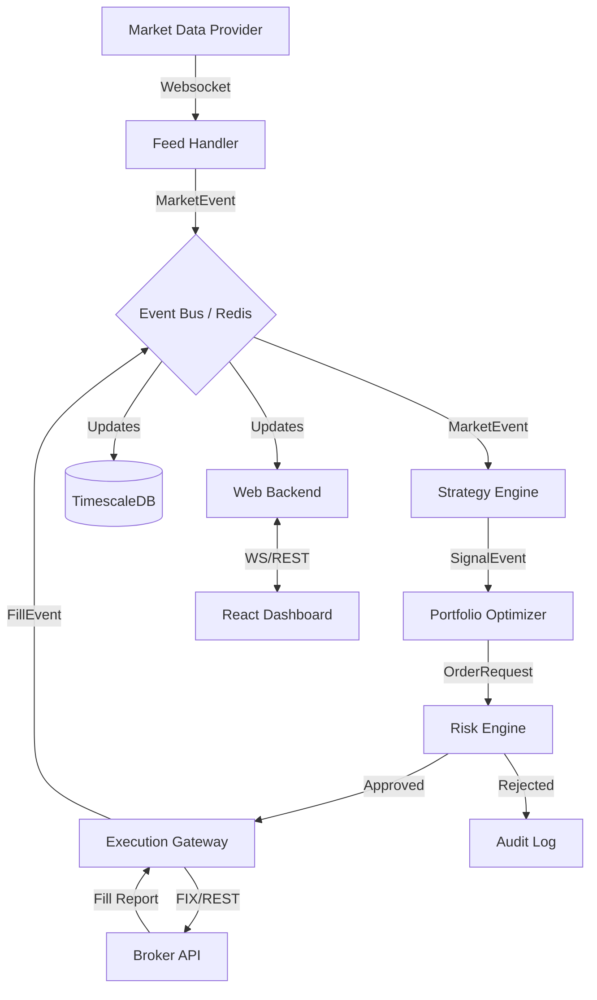

This is a comprehensive architectural blueprint for **"Aegis,"** a production-grade, personal quantitative trading ecosystem. It mimics the internal architecture of a mid-sized systematic hedge fund but scales it down for a single high-performance operator.

---

## 1. Product Goal & Philosophy

### **Vision**

To create a "Glass Box" trading system. Unlike a "Black Box" where inputs go in and money (hopefully) comes out, a Glass Box provides total observability. Every order, signal, and rejection is traceable to a specific line of code, data point, or model version.

### **Core Tenets**

1. **Survival > Profit:** The system prioritizes staying alive. A 50% drawdown is a failure of architecture, not just strategy.
2. **Deterministic Execution:** Given the same data and timestamp, the system must produce the exact same signals (backtest = live).
3. **Latency Awareness:** While not HFT (High-Frequency Trading), the system respects the value of time. Delays are measured and monitored.
4. **Fail-Safe Default:** If a component disconnects or data looks weird, the system halts and neutralizes. It never "guesses."

---

## 2. High-Level System Overview

The system follows an **Event-Driven Architecture (EDA)**.

### **Logical Layers**

1. **The Outer Rim (External World):** Broker APIs (IBKR/Alpaca), Data Feeds (Polygon/AlphaVantage), News Feeds.
2. **The Ingestion Layer (Feed Handlers):** Normalizes external data into internal standard objects.
3. **The Core (The Brain):**
* **Strategy Engine:** Generates *Target Allocations*.
* **Risk Engine:** Validates targets against constraints.
* **Execution Engine:** Splits targets into child orders (TWAP/VWAP/Limit).


4. **The Persistence Layer:** Time-series DB, Object Storage, Ledgers.
5. **The Control Plane (Web Dashboard):** Monitoring, Manual Override, Analysis.

---

## 3. Infrastructure Architecture

We adopt a **Hybrid Cloud** approach to balance cost (compute/storage) and reliability (execution).

### **Topology**

* **Production (AWS/GCP):**
* **Compute:** AWS ECS (Fargate) or a dedicated EC2 instance (c6i.xlarge). We avoid Kubernetes (K8s) for single-user setups to reduce ops overhead, using **Docker Compose** for orchestration.
* **Location:** Same region as the broker's servers (usually US-East-1 for NY markets) to minimize latency.


* **Research/Backtesting (Local Workstation):**
* High-end PC (NVIDIA GPU for ML training).
* Local replica of the database for heavy querying without egress fees.


### **Storage Stack**

| Component | Technology | Reasoning |
| --- | --- | --- |
| **Time-Series DB** | **TimescaleDB** (PostgreSQL) | Best-in-class for financial time-series. Allows SQL queries joining price data with trade logs. |
| **Hot Cache** | **Redis** | Pub/Sub for real-time tick distribution; storing current portfolio state and active orders. |
| **Object Storage** | **S3 / MinIO** | Storing large historical datasets (Parquet files) and ML model artifacts. |
| **Secrets** | **HashiCorp Vault** (or AWS Secrets) | Never store API keys in code or env vars. |

### **Networking**

* **VPN:** The dashboard is **not** exposed to the public internet. Access is via a private WireGuard VPN or AWS SSM.
* **Firewall:** strict egress rules. The container can *only* talk to known broker IPs and data providers.

---

## 4. Backend Architecture

### **Technology Stack**

* **Language:** **Python 3.11+** (Core Logic) + **Rust** (optional, for critical feed handlers if Python is too slow).
* *Justification:* Python is the lingua franca of Quant. Numba/Cython handles bottlenecks.


* **Communication:** **ZeroMQ** (Internal Pub/Sub) + **FastAPI** (Frontend Gateway).
* *Justification:* ZeroMQ is faster and lighter than RabbitMQ/Kafka for this scale.


### **Core Services (Micro-modular Monolith)**

To minimize serialization overhead, these run as modules within a main process or closely coupled containers.

1. **Market Data Service (The "Feed"):**
* Connects to WebSocket streams.
* Checks data integrity (e.g., is Bid < Ask?).
* Publishes `MarketEvent` to the bus.


2. **Strategy Service (The "Alpha"):**
* Subscribes to `MarketEvent`.
* Calculates indicators.
* Emits `SignalEvent` (e.g., "TSLA Score: 0.8").


3. **Portfolio Service (The "Allocator"):**
* Receives `SignalEvent`.
* Optimizes weights (Mean-Variance or Equal Weight).
* Emits `OrderRequestEvent` (Target: Buy 100 TSLA).


4. **Risk Service (The "Gatekeeper"):**
* **CRITICAL:** Intercepts `OrderRequestEvent`.
* Checks: Max Drawdown, Sector Exposure, Leverage Cap, Daily Loss Limit.
* Result: `OrderApproved` or `OrderRejected`.


5. **Execution Service (The "Trader"):**
* Takes `OrderApproved`.
* Routes to Broker API.
* Manages "Smart Order Routing" (e.g., don't dump 1000 shares at once; drip feed).


### **The "Kill Switch"**

A global Redis key `SYSTEM_HALT`. Every service checks this before loop execution. If `True`, all non-closing orders are cancelled immediately.

---

## 5. Quant & Strategy Engine

### **Strategy Abstraction**

Every strategy inherits from an abstract base class `IStrategy`.

```python
class IStrategy:
    def on_init(self): ...       # Load historical data/models
    def on_tick(self, tick): ... # High frequency logic
    def on_bar(self, bar): ...   # Minute/Hour/Day logic
    def on_signal(self): ...     # External trigger (e.g., from ML service)

```

### **Portfolio Construction**

We do not trade ticker-by-ticker. We trade a **Portfolio Target**.

1. Strategies output a "Desire" (e.g., Strategy A wants 10% AAPL, Strategy B wants -5% AAPL).
2. The **Aggregator** nets these positions (Net: +5% AAPL).
3. The **Rebalancer** compares Net vs. Current Holdings.
4. Diff = Orders.

### **Supported Logic**

* **Vectorized Backtesting:** For initial research (Pandas/Polars).
* **Event-Driven Backtesting:** Replays historical ticks through the exact same engine used for live trading. **This is mandatory for verification.**

---

## 6. AI / Machine Learning Layer

### **Philosophy**

AI is a "Suggester," not a "Decider." It maps inputs to probabilities, not trades.

### **Architecture**

* **Offline Training:** Models are trained on the local GPU workstation.
* **Model Registry (MLflow):** Trained models are tagged, versioned, and pushed to S3.
* **Online Inference:**
* The trading engine downloads the tagged model from S3 on startup.
* Or, calls a separate containerized **Inference Service** (TorchServe/ONNX Runtime) via gRPC for heavy models (Transformers).


### **Use Cases**

1. **Regime Detection:** Hidden Markov Model implies "High Volatility." System automatically reduces leverage.
2. **Sentiment Scoring:** BERT model digests RSS news feeds  Score -1 to +1.
3. **Signal Filtering:** "Meta-Labeling." An XGBoost model predicts the probability of the *primary strategy* succeeding. If prob < 0.6, skip the trade.

---

## 7. Data Pipeline & Storage

### **The "Golden Source" Rule**

Never rely on the broker for historical data. You must build your own "Historian."

### **Pipeline**

1. **Ingestion:** Real-time websockets + Nightly REST downloads (for correction).
2. **Validation:** Filter outliers (e.g., price drops 90% in 1ms then recovers).
3. **Normalization:** Convert all timestamps to UTC. Map symbols to internal IDs (handling ticker changes, e.g., FB  META).
4. **Storage:**
* **Hot:** Recent 7 days in TimescaleDB (for active calculation).
* **Cold:** Parquet files in S3 partitioned by `Year/Month/Date`.


### **Point-in-Time (PIT) Architecture**

To prevent Look-Ahead Bias, we store data with two timestamps:

1. `event_timestamp`: When the event happened.
2. `knowledge_timestamp`: When we received it.
*Example:* Earnings released at 16:00 but api delayed until 16:05. Backtest must not trade at 16:01.

---

## 8. Frontend (Web App)

### **Tech Stack**

* **Framework:** **React** + **Vite** (Speed).
* **State:** **Zustand** (Simple, fast global state).
* **Grids:** **AG Grid Enterprise** (The standard for financial rows).
* **Charts:** **Lightweight Charts** (TradingView library) for price; **Recharts** for analytics.
* **Comms:** **Socket.IO** or raw WebSocket.

### **Core Screens**

1. **The Cockpit (Home):**
* Global P&L (Realized/Unrealized).
* Exposure Thermometer (Risk utilization).
* Active Orders table.
* **BIG RED BUTTON:** "Panic Close / Flatten Book."


2. **Strategy Inspector:**
* Breakdown of P&L by strategy.
* Live log stream of strategy logic ("Strategy A requesting Buy because RSI < 30").


3. **The Blotter:**
* Historical trade list.
* Execution quality (Slippage analysis: Arrival Price vs. Fill Price).


4. **System Health:**
* Latency graphs.
* API limit usage.
* Service heartbeat status.


---

## 9. Design System

### **Hedge Fund Aesthetic**

* **Theme:** Strict Dark Mode (OLED Black). Reduced eye strain for 12-hour shifts.
* **Typography:** **JetBrains Mono** or **Roboto Mono** for all data. Alignment is critical.
* **Color Semantics:**
* **Green:** Profit / Buy / Normal.
* **Red:** Loss / Sell / Critical Error.
* **Amber:** Warning / Reaching Limits.
* **Blue:** Informational / Neutral.


* **Density:** High. No generous whitespace. We want information density.

---

## 10. Security & Compliance

1. **Environment Isolation:** Production keys are injected at runtime via Docker Secrets. Developers (you) never see the live keys in the IDE.
2. **Audit Logs:** Every action (system or user) is written to an immutable append-only log in the DB.
* *Entry:* "User manually overrode Strategy A at 14:02:01."


3. **WAF / IP Allow-listing:** The API only accepts requests from the specific VPN IP.

---

## 11. Monitoring & Operations

### **Stack**

**Prometheus** (Metrics) + **Grafana** (Visualization) + **BetterStack/PagerDuty** (Alerting).

### **Key Metrics**

1. **Heartbeat:** Time since last tick received. If > 5 seconds during market hours  Critical Alert.
2. **Order Ack Latency:** Time from `Send` to `Broker_Ack`.
3. **Cash Discrepancy:** `Calculated_Cash` vs `Broker_Reported_Cash`. If diff > $1.00  HALT.

---

## 12. Documentation & Knowledge System

We use **Obsidian** or a self-hosted **Wiki (Wiki.js)** integrated with the repository.

1. **Strategy Papers:** Before code is written, a "Whitepaper" is written.
* *Hypothesis:* Why should this work?
* *Universe:* What assets?
* *Risks:* When does this blow up?


2. **Runbooks:** "What to do if the API disconnects while holding a leveraged position."
3. **Change Log:** Every deployment is logged with the Git Commit Hash.

---

## 13. Development Roadmap

### **Phase 1: The Skeleton (Months 1-2)**

* Setup Infrastructure (Docker/DB).
* Build Data Ingestion (Get historical data).
* Build "Paper Trading" mode (Simulate broker).
* **Deliverable:** A dashboard showing live data and simulated P&L.

### **Phase 2: The Guardrails (Month 3)**

* Build the Risk Engine.
* Implement Kill Switches.
* Build the "Historian."
* **Deliverable:** A system that stops itself from losing money in simulation.

### **Phase 3: Alpha (Month 4-5)**

* Port 1 simple strategy (e.g., Mean Reversion).
* Connect to Real Broker (Small capital).
* **Deliverable:** First live dollar made/lost.

### **Phase 4: Intelligence (Month 6+)**

* Integrate ML models.
* Advanced Execution algorithms.
* Portfolio Optimization.

---

## 14. Summary of Architecture (Logical Flow)

