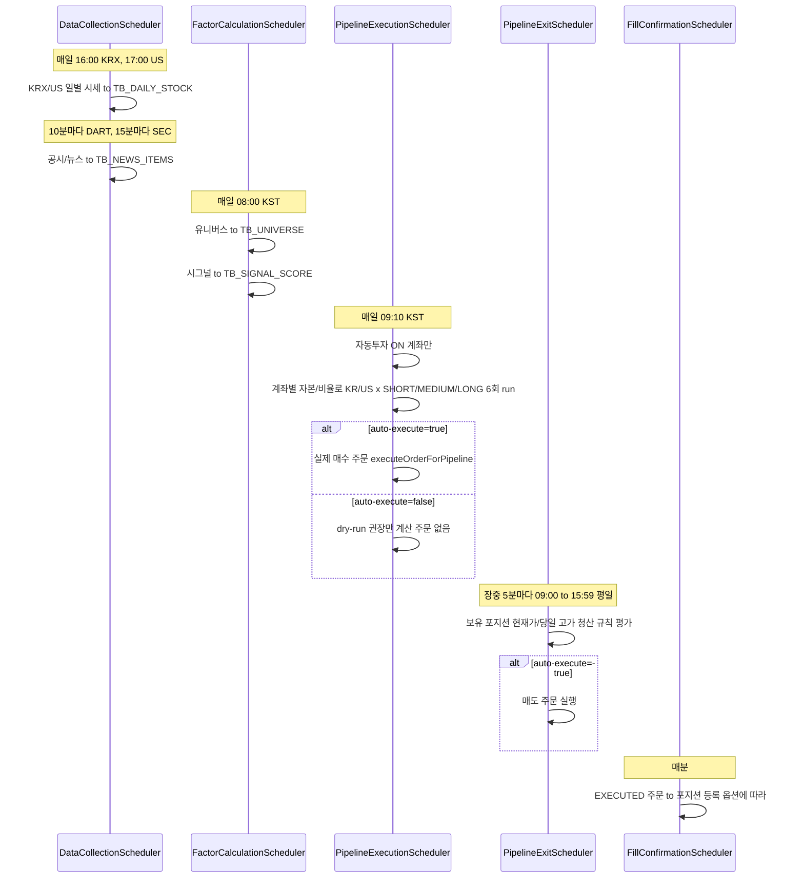

# 자동투자 전략 명세 (공격형 로보어드바이저)

## 개요

이 문서는 **헤지펀드형 퀀트(Quant) 트레이딩 엔진** 기반 **최상위 공격형 로보어드바이저**의 전략·알고리즘·데이터 원천·실전 구축 전략을 정의합니다. 일반 자산배분 엔진이 아닌 **4단계 파이프라인**(유니버스 선정 → 시그널 생성 → 자금 관리 → 매매 실행) 안에서 시장별(한국/미국)·분류별로 상이한 수학적 모델을 적용합니다.

**참고**: 상세 수치·파라미터·계산 수식·나라별·기간별 전략은 **[00-strategy-registry.md](./00-strategy-registry.md)** 를 단일 소스로 참조한다. 규칙 엔진 구조는 [05-quantitative-strategy.md](./05-quantitative-strategy.md) 참조.

---

## 1. 수익·리스크 목표

- **MDD(최대 낙폭)**: -15% 이내 통제
- **목표 수익률**: 연평균 **CAGR 30% 이상** (초과 수익 모델)
- **생명선**: **속도(Latency)** 와 **정확도(Accuracy)** — 0.1초 단위 정보 해석·주문 실행이 승부를 가름

---

## 2. Core Logic — 두 가지 대전제

### 2.1 켈리 공식 (Kelly Criterion) 응용 — 베팅 비율 최적화

- **수식**: \( f^* = \frac{bp - q}{b} \)
  - \( f^* \): 투입 비중
  - \( b \): 배당률(수익/손실비)
  - \( p \): 승률
  - \( q \): 패배율 (\( q = 1 - p \))
- **적용**: 승률 60% 이상 **그리고** 손익비 2:1 이상 구간에서만 비중 투입.
- **안전장치**: 산출 \( f^* \) 의 50%만 적용 (Half-Kelly)하여 파산 위험 방지.

### 2.2 변동성 돌파 (Volatility Breakout) — 추세 추종

- **수식**: \( \text{Target Price} = \text{Open} + (\text{Range} \times k) \)
  - Range: 전일 고가 − 전일 저가
  - k: 노이즈 비율 (보통 0.5 이하)
- **적용**: 방향성 확정 시점에 진입해 추세 수익 확보. 한국장은 9:00~10:00 변동성이 크므로 k 값 동적 적용 권장.

---

## 3. 기간별 세부 알고리즘 및 필터

| 구간 | 비중 | 목표 수익률 | 대상 | 매수 필터 | 매도/리스크 |
|------|------|-------------|------|-----------|-------------|
| **단기** | 20% | 주간 5%+ / 월간 20%+ | 미국 3배 레버리지 ETF(TQQQ, SOXL), 한국 테마 대장주 | 유동성(한국 5일 평균 거래대금 >1,000억, 미국 >5억 달러), RSI(14)>60 & MACD>Signal, 수급(기관/외국인 순매수 2일+ & 체결강도 120%+) | Trailing Stop: 고점 대비 -3% 시 기계적 매도 |
| **중기** | 40% | 분기 15%+ | 주도 섹터(반도체, AI, 2차전지, 바이오 등) 1등주 | 듀얼 모멘텀: 3개월 수익률 S&P500/KOSPI 대비 상위 10%, EPS 성장(YoY)>20%, PEG<1.5, 주가가 20·60일선 위 정배열 | 월 1회 리밸런싱, 모멘텀 순위 하락 시 교체; 개별 -10% 도달 시 손절 |
| **장기** | 40% | 연 25%+ (복리 극대화) | 경제적 해자 확실한 글로벌 1위 (미국 빅테크 위주) | 퀄리티: ROE>20%, OPM>25%; Rule of 40(매출증가율+영업이익률>40%); MDD -15%~-20% 시 분할 매수 트리거 | 펀더멘털 훼손 시에만 매도; 상대적 손절 없음(저가 시 추가 매수) |

---

## 4. 시드 배분 및 리스크 관리 (Money Management)

### 4.1 포트폴리오 비중 (총 100%)

- **슈퍼 그로스(장기) 40%**: 예) 엔비디아, MS, 테슬라 등 (미국 8 : 한국 2) — 손절 없음, 하락 시 추가 매수.
- **추세 추종(중기) 40%**: 섹터 1등주, SOXL, TQQQ 등 — 개별 -10% 도달 시 손절.
- **알고리즘 트레이딩(단기) 20%**: 당일 거래량 상위 테마주, 뉴스 모멘텀 — **-3% 칼손절 절대 원칙**.

### 4.2 ATR 기반 포지션 사이징 (1회 매매당 총자산 1% 리스크)

- **수식**: \( \text{Position Size} = \frac{\text{Total Capital} \times 1\%}{\text{Entry Price} - \text{Stop Loss}} \)
- **예**: 자산 1억, 현재가 10만 원, 손절가 9.5만 원 → 100만/5,000 = 200주.
- **목적**: 연속 10회 손실 시에도 자산 90% 보존으로 재기 가능.

### 4.3 변동성 역가중 (Inverse Volatility Weighting)

- 비중 ∝ 1/σ (σ: 해당 종목 역사적 변동성). 변동성 큰 종목은 비중 축소, 우상향 종목은 비중 확대.

---

## 5. 헤지펀드 퀀트 엔진 — 4단계 파이프라인 및 핵심 알고리즘

공격형 로보어드바이저는 **유니버스 선정 → 시그널 생성 → 자금 관리 → 매매 실행** 4단계 파이프라인 안에서, **한국/미국 시장별·분야별로 다른 수학적 모델**을 적용합니다. 분류별로 효과적인 알고리즘이 다르면 분류해 적용합니다.

### 5.1 1단계: 유니버스 필터링 (Universe Selection)

**질문**: "어떤 종목을 감시 대상에 넣을 것인가?"

| 구분 | 알고리즘 명칭 | 수식/로직 | 목적 |
|------|---------------|-----------|------|
| **공통** | Liquidity Cut-off | 거래대금 ≥ 최소 거래대금 임계값 | 슬리피지 방지 및 탈출구 확보 |
| **미국** | Post-Earnings Drift | 어닝 서프라이즈 강도 상위 20% 종목 추출 | 실적 이벤트 모멘텀 활용 |
| **한국** | Sector Relative Strength | 시장 대비 강한 '주도 업종' 내 종목만 필터링 | 수급·순환매 중심 한국장 특성 반영 |

### 5.2 2단계: 시그널 생성 (Signal Generation)

**질문**: "언제, 무엇을 살 것인가?"

#### 미국 (효율적 시장, 추세 지속성 강함)

- **듀얼 모멘텀 스코어링**: 기간별 수익률 가중합(최근 1개월 가중치 권장). 조건: 종목 모멘텀 > 시장 모멘텀 (시장보다 강한 종목만 매수).
- **퀄리티-성장 팩터**: PEG & Rule of 40 합산 점수 상위 10% (빅테크·성장주).
- **VAA(Vigilant Asset Allocation) 변형**: SPY/EFA/EEM/BND 중 모멘텀 스코어 최고 1개 자산에 100% 배분, 하락 시 현금/채권 100% 이탈.

#### 한국 (비효율적 시장, 수급·사이클 위주)

- **수급 강도 (Smart Money Intensity)**: 최근 5일 누적 순매수 금액이 시총의 일정 비율(예: 0.5%) 초과 시 매수 시그널.
- **이격도 과열/침체 (Disparity Ratio Reversion)**: Disparity = (현재가 / 이동평균) × 100. 공격형: 105 돌파 후 102로 눌릴 때 매수(눌림목); 역발상: 85 이하 분할 매수(과매도).
- **변동성 돌파 (한국형 튜닝)**: Target = Open + (Range × k). 한국장 9:00~10:00 변동성 반영해 k 값 동적 적용 (데이트레이딩/단기 스윙).

### 5.3 3단계: 자금 관리 및 베팅 비율 (Position Sizing)

**질문**: "얼마나 살 것인가?"

- **켈리 공식 (Half-Kelly)**: 위 §2.1 참조.
- **변동성 역가중**: 위 §4.3 참조.

### 5.4 4단계: 매매 실행 및 청산 (Execution & Exit)

**질문**: "언제 팔 것인가?"

- **ATR Trailing Stop (추적 손절)**: 익절 라인이 상승을 따라 이동. 공격형은 Multiplier 2.0~2.5로 설정 — 흔들림은 견디되 추세 꺾이면 즉시 매도.
- **Time-Cut (시간 청산)**: 매수 후 N일(예: 5일) 내 목표 수익률(예: 3%) 미도달 시 기회비용으로 간주하고 전량 매도.

---

## 6. 로보어드바이저 구축 로드맵 (개발)

1. **데이터 수집**: Yahoo Finance API(미국), KRX/OpenDart API(한국) 연동. (§7 확정 원천만 파이프라인 연결)
2. **팩터 계산 엔진**: 2단계 시그널 수식을 Python(Pandas/Numpy)으로 구현, **매일 장 시작 전** 종목별 점수 산출.
3. **백테스팅 (필수)**: 과거 10년 데이터로 알고리즘 시뮬레이션. 특히 **2020년 코로나 폭락장**, **2022년 금리 인상기** 방어율 검증.

**상세**: [roadmap.md](../roadmap.md)

### 6.1 구현 상태

**4단계 파이프라인 1차 구현 완료** (2026-01-30):
- ✅ 1단계 유니버스: 유동성(Liquidity Cut-off) 필터
- ✅ 2단계 시그널: 이격도·변동성 돌파·유동성 팩터
- ✅ 3단계 자금 관리: ATR 포지션 사이징·변동성 역가중
- ✅ 4단계 실행·청산: Time-Cut 청산 규칙

**4단계 파이프라인 확장 1차 완료** (2026-01-30):
- ✅ 변동성 돌파 k 동적 적용 (한국장 변동성 반영)
- ✅ Half-Kelly 자금 관리 (기본값 p=0.6, b=2.0)
- ✅ ATR Trailing Stop 청산 규칙 (장중 고가·현재가 연동)
- ✅ 체결 확인 후 포지션 등록 옵션
- ✅ 유니버스 필터 확장 스텁 (한국 Sector RS, 미국 Post-Earnings Drift)
- ✅ 시그널 확장 스텁 (한국 수급 강도, 미국 듀얼 모멘텀·퀄리티-성장)

**시장·기간별 전략 로직 반영** (2026-01-31):
- ✅ 단기(SHORT_TERM): -3% Trailing Stop 청산, 시그널 필터 RSI>60 & MACD>Signal(TechnicalIndicatorUtil)
- ✅ 중기(MEDIUM_TERM): -10% 손절·Time-Cut 청산, 시그널 상위 10% 필터, 월 1회 리밸런싱 스케줄 훅(스텁)
- ✅ 장기(LONG_TERM): 청산 스텁(매도 시그널 없음), 시그널 전체 사용
- ✅ 시드 배분 20/40/40, PipelineExecutionScheduler(0.2/0.4/0.4 배분·KR/US×SHORT/MEDIUM/LONG 6회 run)
- ✅ TB_STRATEGY_POSITION STRATEGY_TYPE, PipelineExecutor·PositionSizingService strategyType 연동

**후속 개발 필요** (데이터 수집 후):
- ⏳ 유니버스 필터 실제 구현 (업종별 수익률·어닝 서프라이즈 데이터 수집 필요)
- ⏳ 시그널 실제 계산 (수급 데이터·미국 일별/재무 데이터 수집 필요)
- ⏳ Half-Kelly 백테스트 연동 (전략별 p·b 값 산출)
- ⏳ 체결 확인 스케줄러/리스너 구현

**실제 주문 활성화**: 기본값이 `investment.pipeline.auto-execute=false`이므로, 실제 매수/매도가 나가게 하려면 아래 §6.2 체크리스트대로 서버 설정을 켜면 된다.

**상세**: [개발 진행 현황](../09-planning/02-development-status.md), [전략 통합 문서](./00-strategy-registry.md)

### 6.2 자동투자 프로세스 플로우

자동투자는 **데이터 수집 → 팩터 계산 → 파이프라인 실행 → 청산 평가 → 체결 확인** 순으로 스케줄에 따라 동작한다.

**스케줄 요약**

| 단계 | 스케줄 (기본값) | 설명 |
|------|------------------|------|
| 데이터 수집 | DART 10분마다, SEC 15분마다, KRX 16:00, US 17:00 | TB_DAILY_STOCK, TB_NEWS_ITEMS 등 |
| 팩터 계산 | 매일 08:00 KST | 유니버스 → 시그널 (TB_UNIVERSE, TB_SIGNAL_SCORE) |
| 파이프라인 실행 | 매일 09:10 KST | 자동투자 ON 계좌만, 6회 run; auto-execute 여부에 따라 주문 실행 여부 결정 |
| 청산 | 장중 5분마다 (09:00~15:59 평일) | Trailing Stop / -10% 손절 / Time-Cut 등; auto-execute=true일 때만 매도 주문 |
| 체결 확인 | 매분 | 체결된 주문 → 포지션 등록 (register-position-on-execution 옵션) |

**실제 자동 주문을 쓰기 위한 체크리스트**

1. **설정 화면 (/settings)**: 계좌 선택, 거래 설정 저장, **자동 매매 ON** 체크, 최대 투자금액·단기/중기/장기 비율 입력.
2. **서버 설정**: `investment.pipeline.auto-execute: true` 또는 환경변수 `PIPELINE_AUTO_EXECUTE=true`. (기본값은 false라 설정하지 않으면 dry-run만 동작.)
3. **모의계좌 권장**: 실전 전 모의 2주 테스트. [로드맵 Phase 7](../roadmap.md) 참조.
4. **모의계좌 실제 실행**: 모의 앱키·계좌 인증 완료, `PIPELINE_ALLOW_REAL_EXECUTION=false`(기본)로 실전 계좌 자동 실행 미허용. 실전 계좌 자동 실행은 `PIPELINE_ALLOW_REAL_EXECUTION=true`로만 허용.
5. **모의 Rate Limit**: 한국투자증권 모의투자 1초당 2건 제한 인지. 스케줄(09:10 실행·장중 청산·체결 확인) 확인.

---

## 7. 공시/데이터·뉴스/센티멘트 원천 확정 (파이프라인 연결 소스)

**설계 원칙**: 가장 신뢰할 수 있고, 데이터 처리가 용이하며, 트래픽이 몰려 시장 방향성을 결정짓는 **공시/데이터 원천**과 **뉴스/센티멘트 원천**만 확정해, **이 소스들만** 파이프라인에 연결합니다.

### 7.1 시스템 설계용 데이터 소스 요약표

| 구분 | 역할 | 한국 (KOSPI/KOSDAQ) | 미국 (NYSE/NASDAQ) |
|------|------|----------------------|---------------------|
| **Fact (절대 기준)** | 펀더멘털, 실적, 공시 | **DART (전자공시·Open API)** | **SEC EDGAR (API)** |
| **Speed (뉴스 트리거)** | 재료, 모멘텀, 테마 | **연합뉴스 (Yonhap)** | **Reuters (로이터)** |
| **Buzz (군중 심리)** | 수급, 유동성, 심리 | **네이버 금융 (Naver)** | **Yahoo Finance** |

### 7.2 한국 — 원천 상세

- **Fact — DART (전자공시시스템)**: 금융감독원(FSS) 운영, 법적 효력 유일 원천. 실적 발표, 유무상증자, 단일판매공급계약, CB 발행 등. **Open DART API** 연동·실시간 공시 모니터링, 핵심 키워드(예: '무상증자', '영업익 30% 증가') 포착 즉시 매수 시그널.
- **Speed — 연합뉴스 (Yonhap)**: 국가 기간 통신사, 가장 빠른 속보. 정치 테마, 정부 정책, 사회 이슈. 팩트 위주·NLP 분석에 최적, '속보'·'긴급' 키워드 가중치 부여.
- **Buzz — 네이버 금융 (Naver)**: 트래픽 1위, 투자자 90%+ 노출. '많이 본 뉴스', '실시간 검색 종목' 크롤링으로 **단기 유동성 수급(Momentum)** 포착.

### 7.3 미국 — 원천 상세

- **Fact — SEC EDGAR**: SEC 운영. 10-K, 10-Q, 8-K. **SEC API**로 내부자 거래(Insider)·지분 변동(13F) 포착, 재무 원본으로 퀀트 지표(PER, ROE 등) 자동 갱신.
- **Speed — Reuters (로이터)**: 글로벌 표준, 개발자 친화적. Fed 발언, M&A 등. 감정 분석(Sentiment)에 적합한 정제 영어, 헤드라인 위주로 속도전 유리.
- **Buzz — Yahoo Finance**: 전 세계 트래픽 1위, `yfinance` 등 비공식 API 풍부. OHLCV, 애널리스트 Consensus, 옵션, **Earnings Calendar**, **Analyst Upgrades/Downgrades** — 차트/지표 베이스 및 실적·리서치 소스.

### 7.4 구현 가이드 (Implementation Tip)

1. **미국장**: Yahoo Finance로 기본 차트/지표 계산. **SEC EDGAR 8-K(수시공시)** 발생 시 **최우선 순위**로 로직 실행 — 실적 서프라이즈 반응 속도 극대화.
2. **한국장**: **Open DART API** 필수. 장 마감 후 공시·장중 '단일판매공급계약' 등은 상한가 직행 요인 → **Real-time Push** 수신 구조가 승패를 가름.

**상세**: [13-news-collection-design.md](./13-news-collection-design.md)

---

## 8. 한국투자증권 API 기반 실전 구축 전략 (KIS Developers)

시그널이 만들어지면 '손가락' 역할을 하는 **한국투자증권 KIS Open API** 연동 시 적용할 기술 전략입니다. 국내·미국 주식 하나의 인터페이스로 통합하며, 국내 증권사 중 REST API·WebSocket 지원이 가장 안정적입니다.

### 8.1 ① 실시간 시세 및 체결 파이프라인 (WebSocket 우선)

REST API는 호출 제한(초당 횟수)이 있어 공격형 트레이딩에 불리하므로, **시세 수집·주문 결과 확인은 WebSocket**을 우선 사용합니다.

- **실시간 호가/체결가 수신**: 국내·미국 주식 틱(Tick) 데이터를 WebSocket 구독 → **변동성 돌파 시그널**을 0.1초 단위로 감시.
- **체결 통보 (Push)**: 주문 체결 즉시 API 서버에서 오는 Push 수신 → **다음 포지션(익절/손절 매도) 대기 로직** 즉시 활성화.

### 8.2 ② API 데이터 기반 퀀트 스코어링 (REST 활용)

한투 API에서 제공하는 데이터를 알고리즘 변수에 반영합니다.

- **국내 주식**: **순위 분석 API**(거래대금 상위, 등락률 상위) 호출 → 당일 '주도주 유니버스' 매일 아침 자동 업데이트. **투자자별 매매동향 API** → 장중 외국인/기관 순매수 10분 단위 체크 → **수급 점수(Supply Score)** 반영.
- **미국 주식**: **해외주식 기간별 시세** — 야후 대신 한투 API 내 해외주식 시세 사용으로 **데이터 정합성** 확보(환율 계산 포함).

### 8.3 ③ 리스크 관리: API 호출 제한 및 보안

- **Throttling 관리**: 실전 계좌 기준 **초당 약 20회**(주문은 초당 2~10회) 제한. **대응**: 여러 종목 시그널 동시 발생 시 주문 요청을 **큐(Queue)**에 넣어 순차 처리 — **메시지 큐(RabbitMQ 등)** 도입 권장.
- **토큰 자동 갱신**: Access Token 유효기간(24시간) 고려 → **장 시작 30분 전** 매일 자동 발급하는 **Crontab** 스크립트 배치.

### 8.4 ④ 시드 배분 및 주문 실행 (한투 계좌·통합 증거금 반영)

한국투자증권 **국내/해외 통합 증거금** 서비스를 쓰면 시드 관리가 효율적입니다.

| 구분 | 한투 API 매매 처리 방식 | 비중 관리 로직 |
|------|-------------------------|----------------|
| **국내 주식** | 지정가(Limit) 및 **최유리 지정가** 주문 활용 | 예수금의 **30~50%** 내에서 종목별 변동성 비중 할당 |
| **미국 주식** | **실시간 시세(유료)** 연동 및 시장가 주문 | 환전 없이 **통합증거금** 사용 (환전 수수료 절감) |
| **모의 투자** | `Virtual` 환경 지원 | 알고리즘 고도화 후 실전 투입 전 **2주간** 테스트 |

**상세**: [09-korea-investment-api-guide.md](../04-api/09-korea-investment-api-guide.md)

---

## 9. 용어·정의

- **시장 레짐(Market Regime)**, **VaR/CVaR**, **Sharpe/Sortino/Calmar**, **R:R**, **MDD**, **CAGR**, **PEG**, **Rule of 40**, **듀얼 모멘텀**, **Smart Money Intensity**, **Disparity**, **VAA** 등은 전략·백테스트 문서에서 동일한 정의로 사용합니다.

---

## 10. 확장성

- 새 지표·시장·분류·필터 추가 시 확장 포인트를 명시하고, 기존 파이프라인 구조를 유지한 채 플러그인 형태로 확장합니다.

---

## 문서 변경 이력

| 버전 | 일자 | 작성자 | 변경 내용 |
|------|------|--------|----------|
| 1.0 | 2026-01-29 | System | 초기 자동투자 전략 명세 작성 — 4단계 파이프라인·시장별 알고리즘·원천·KIS 실전 구축 반영 |
| 1.1 | 2026-01-31 | System | 전략 통합 문서 분리·기간별 전략 반영 — 상세 수식·파라미터는 [00-strategy-registry.md](./00-strategy-registry.md) 참조로 정리 |
| 1.2 | 2026-02-01 | System | §6.2 자동투자 프로세스 플로우 추가 — 스케줄 요약·시퀀스 다이어그램·실제 주문 활성화 체크리스트; 후속 개발에 auto-execute 설정 명시 |
