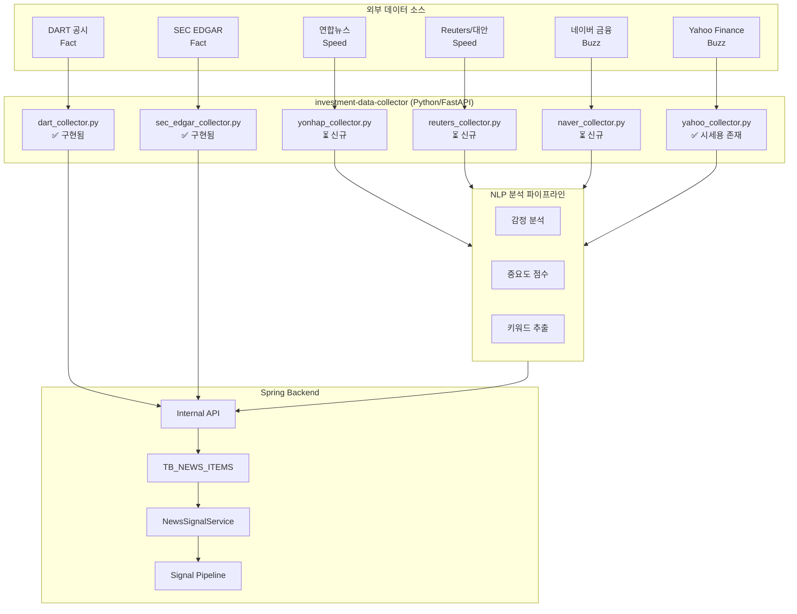

# 뉴스·공시 수집·연동 설계

## 개요

이 문서는 투자 의사결정에 활용하는 **공시/데이터(Fact)**·**뉴스/속보(Speed)**·**센티멘트/수급(Buzz)** 수집·정규화·전략 연동 설계를 정의합니다. **속도(Latency)·정확도(Accuracy)** 확보를 위해 **[12-auto-investment-strategy.md](./12-auto-investment-strategy.md) §7에서 확정한 원천만** 파이프라인에 연결합니다.

---

## 1. 설계 원칙

- **확정 원천만 연결**: 가장 신뢰할 수 있고, 데이터 처리가 용이하며, 트래픽이 몰려 시장 방향성을 결정짓는 **공시/데이터 원천**과 **뉴스/센티멘트 원천**만 파이프라인에 연결.
- **속도·정확도 우선**: 0.1초 단위 정보 해석·시그널 반영이 목표이므로, Real-time Push(공시)·최우선 순위 로직(8-K 등)을 적용.
- **Fallback**: 원천 미수집·장애 시 전략은 해당 입력 없이 동작하거나, 캐시/기본값으로 대체. 파이프라인 전체 중단은 방지.

---

## 2. 확정 원천 (파이프라인 연결 소스)

### 2.1 시스템 설계용 데이터 소스 요약표

| 구분 | 역할 | 한국 (KOSPI/KOSDAQ) | 미국 (NYSE/NASDAQ) |
|------|------|----------------------|---------------------|
| **Fact (절대 기준)** | 펀더멘털, 실적, 공시 | **DART (전자공시·Open API)** | **SEC EDGAR (API)** |
| **Speed (뉴스 트리거)** | 재료, 모멘텀, 테마 | **연합뉴스 (Yonhap)** | **Reuters (로이터)** |
| **Buzz (군중 심리)** | 수급, 유동성, 심리 | **네이버 금융 (Naver)** | **Yahoo Finance** |

### 2.2 한국 — 원천 상세

- **Fact — DART (전자공시시스템)**
  - **권위**: 금융감독원(FSS) 운영, 법적 효력 유일 원천.
  - **용도**: 실적 발표, 유무상증자, 단일판매공급계약, CB 발행 등.
  - **로보어드바이저 활용**: **Open DART API** 연동·실시간 공시 모니터링. 핵심 키워드(예: '무상증자', '영업익 30% 증가') 포착 즉시 매수 시그널 발생.
  - **구현 권장**: **Real-time Push** 수신 구조. 장 마감 후 공시·장중 '단일판매공급계약' 등은 상한가 직행 요인으로, Push 미지원 시 짧은 폴링 주기 적용.

- **Speed — 연합뉴스 (Yonhap)**
  - **권위**: 국가 기간 뉴스 통신사. 모든 언론사가 연합뉴스를 받아쓰기 때문에 가장 빠름.
  - **용도**: 정치 테마, 정부 정책 발표, 사회적 이슈(전염병, 전쟁 등).
  - **로보어드바이저 활용**: 팩트 위주·건조한 문체로 **NLP(자연어 처리)** 분석에 최적화. '속보', '긴급' 키워드 가중치 부여.

- **Buzz — 네이버 금융 (Naver)**
  - **권위**: 압도적인 트래픽 1위. 한국 투자자의 90% 이상이 보고 있는 화면.
  - **용도**: 현재 시장에서 가장 핫한 종목(거래상위, 인기검색어) 파악.
  - **로보어드바이저 활용**: '많이 본 뉴스', '실시간 검색 종목' 순위를 크롤링하여 **단기 유동성 수급(Momentum)** 포착용으로 활용. 이용 약관·로봇 배제 정책 준수.

### 2.3 미국 — 원천 상세

- **Fact — SEC EDGAR**
  - **권위**: 미국 증권거래위원회(SEC) 운영.
  - **용도**: 10-K(연차보고서), 10-Q(분기보고서), 8-K(수시보고서/중대사건).
  - **로보어드바이저 활용**: **SEC API**를 통해 내부자 거래(Insider Trading) 및 지분 변동(13F) 포착. 재무제표 원본 데이터로 퀀트 지표(PER, ROE 등) 자동 갱신. **8-K(수시공시) 발생 시 최우선 순위로 로직 실행** — 실적 서프라이즈 반응 속도 극대화.

- **Speed — Reuters (로이터)**
  - **권위**: 블룸버그와 함께 세계 양대 산맥, 시스템 연동 면에서 개발자 친화적.
  - **용도**: 글로벌 거시경제(Fed 발언, 전쟁, 유가), 기업 M&A 소식.
  - **로보어드바이저 활용**: 감정 분석(Sentiment Analysis) 알고리즘이 가장 잘 먹히는 정제된 영어 문장. 불필요한 수식어 없이 핵심(Headline)만 빠르게 전달되므로 알고리즘 속도전에 유리.

- **Buzz — Yahoo Finance**
  - **권위**: 전 세계 트래픽 1위, 가장 많은 비공식 API(`yfinance`) 지원.
  - **용도**: 주가 데이터(OHLCV), 애널리스트 추정치(Consensus), 옵션 데이터.
  - **로보어드바이저 활용**: 실시간 가격 데이터 및 보조지표 산출의 베이스캠프. 'Earnings Calendar'와 'Analyst Upgrades/Downgrades' 데이터 소스로 활용. 미국장 기본 차트/지표는 Yahoo로 계산하고, **SEC EDGAR 8-K 발생 시 최우선** 로직 실행.

### 2.4 구현 범위 (현재 vs 목표)

- **현재 구현**: Fact(DART, SEC EDGAR) 공시 수집·TB_NEWS_ITEMS 저장, 시세(KRX, US) 수집·TB_DAILY_STOCK 등 저장. 파이프라인에는 이 원천들만 연결됨.
- **미구현(목표)**: Speed(연합뉴스, 로이터), Buzz(네이버 금융, Yahoo Finance) 뉴스/센티멘트 수집·저장·시그널 연동은 본 문서 설계대로 추후 구현 예정. [12-auto-investment-strategy.md](./12-auto-investment-strategy.md) §7.5와 동일 기준.

---

## 3. 구현 가이드 (Implementation Tip)

1. **미국장**: Yahoo Finance로 기본 차트/지표 계산. **SEC EDGAR 8-K(수시공시)** 발생 시 **최우선 순위**로 로직 실행 — 실적 서프라이즈 반응 속도 극대화.
2. **한국장**: **Open DART API** 필수. 장 마감 후 공시·장중 '단일판매공급계약' 등은 상한가 직행 요인 → **Real-time Push** 수신 구조가 승패를 가름.

---

## 4. 수집·저장 설계

### 4.1 수집 주기·방식

- **Fact (공시)**
  - **한국 DART**: Open DART API 실시간(또는 단기 폴링) 공시 목록 조회. 키워드·종목코드 필터링 후 즉시 파이프라인 이벤트 발행.
  - **미국 SEC EDGAR**: SEC API로 8-K·10-K·10-Q 등 수집. 8-K는 실시간 또는 1분 이내 폴링 권장.
- **Speed (뉴스)**
  - **연합뉴스**: RSS/API(제공 시) 또는 수집 주기(예: 1~5분). '속보'·'긴급' 태그 가중치 부여.
  - **Reuters**: API(구독) 또는 허용 범위 내 수집. 헤드라인·요약 우선 저장.
- **Buzz (수급·심리)**
  - **네이버 금융**: 이용 약관 준수 하에 '많이 본 뉴스', '실시간 검색 종목' 등 주기 수집(예: 10분). 스크래핑 시 Rate Limit·User-Agent 정책 준수.
  - **Yahoo Finance**: `yfinance` 또는 공식 API. Earnings Calendar·Analyst Up/Down 주기 동기화.

### 4.2 저장 스키마 (개념)

- **공시/뉴스 원문**: 원천 ID, 시장(KR/US), 유형(Fact/Speed/Buzz), 제목, 본문 요약, URL, 수집 시각, 종목코드(연관), 키워드.
- **감정/중요도**: 문서 ID, 감정 점수(긍정/부정/중립), 중요도 점수, 섹터/종목 영향도, 이벤트 유형(실적·배당·M&A 등).
- **전략 연동용 캐시**: 종목별·시간대별 요약 점수(수급 점수, 뉴스 감정 보정 등). TTL 적용해 최신성 유지.

### 4.3 중복·품질 관리

- **중복**: URL·해시 기반 중복 제거. 동일 공시/뉴스 다중 원천 수집 시 최초 수신만 파이프라인 이벤트로 사용.
- **품질**: 제목/본문 길이·언어 검증. 스팸·광고 패턴 제외.

---

## 5. 분석 (감정·중요도·이벤트)

- **감정(긍정/부정/중립)**: NLP 모델 또는 키워드 기반. 한국어(연합·네이버)·영어(Reuters·Yahoo) 별도 처리.
- **중요도·영향도**: 섹터/종목 태깅, 실적·배당·M&A 등 이벤트 유형 분류. 전략 쪽에서 가중치·필터 조건으로 사용.
- **한국 특화**: '속보'·'긴급' 키워드 가중치 부여.

---

## 6. 전략 연동

- **점수 반영**: 시그널 생성 단계에서 뉴스/공시 기반 점수(수급 점수, 감정 보정 등)를 가중치 적용해 합산. 가중치·임계값은 전략 파라미터로 관리.
- **시그널 점수 반영 강화**: `NewsSignalService.getSymbolScoresWithSignalNews(market, basDt)`로 종목별 시그널 점수(Map) 반환. `investment.news.signal-weight`(기본 1.0)로 시그널 공시 종목 우선도 조정. `PositionSizingService` 권장 목록 정렬 시 점수 내림차순 적용(시그널 종목 우선).
- **레짐/필터**: 공시 이벤트(무상증자, 실적 서프라이즈 등) 발생 시 유니버스·시그널 필터 일시 완화 등 조건부 로직 허용.
- **Fallback**: 원천 미수집·장애 시 해당 입력만 제외하고 나머지 지표로 시그널 생성. 파이프라인 중단 없음.

---

## 7. 확장

- 신규 소스 추가 시 [12-auto-investment-strategy.md](./12-auto-investment-strategy.md) §7 요약표·구현 가이드와 정합성 유지. 확정 원천 외 소스는 “참고용” 저장만 하고 파이프라인 시그널에는 미반영하거나, 별도 플래그로 제한 반영.

---

## 8. Speed/Buzz 계층 구현 상세 설계

이 섹션은 미구현 상태인 Speed/Buzz 계층의 구현 상세 설계를 정의합니다.

### 8.1 시스템 아키텍처



### 8.2 Speed 계층 구현 상세

#### 8.2.1 연합뉴스 (Yonhap) 수집기

| 항목 | 설명 |
|------|------|
| **수집 방식** | RSS 파싱 (공식 API 미제공) |
| **RSS URL** | `https://www.yna.co.kr/rss/economy.xml` (경제), `https://www.yna.co.kr/rss/industry.xml` (산업) |
| **폴링 주기** | 3분 |
| **파일 경로** | `investment-data-collector/collectors/yonhap_collector.py` |
| **시그널 키워드** | 속보, 긴급, 급등, 급락, M&A, 인수, 합병, 실적 |

```python
# yonhap_collector.py 설계
YONHAP_RSS_URLS = [
    "https://www.yna.co.kr/rss/economy.xml",
    "https://www.yna.co.kr/rss/industry.xml",
]
SIGNAL_KEYWORDS = ["속보", "긴급", "급등", "급락", "M&A", "실적"]

def fetch_yonhap_news() -> List[Dict]:
    items = []
    for url in YONHAP_RSS_URLS:
        feed = feedparser.parse(url)
        for entry in feed.entries:
            items.append({
                "source": "YONHAP",
                "market": "KR",
                "itemType": "SPEED",
                "title": entry.title,
                "summary": entry.get("summary", "")[:500],
                "url": entry.link,
                "collectedAt": parse_date(entry.published),
            })
    return items
```

#### 8.2.2 미국 뉴스 수집기 (Reuters 대안)

Reuters는 유료 구독 서비스이므로 초기 구현 시 무료 대안 활용:

| 대안 | 설명 | 비용 |
|------|------|------|
| Google News RSS | 금융 키워드 검색 RSS | 무료 |
| NewsAPI.org | REST API, 무료 플랜 500회/일 | 무료/유료 |

```python
# reuters_collector.py (Google News 대안)
GOOGLE_NEWS_RSS = "https://news.google.com/rss/search?q={query}&hl=en-US&gl=US"
QUERIES = ["stock market", "earnings report", "Fed interest rate"]

def fetch_us_news() -> List[Dict]:
    items = []
    for query in QUERIES:
        url = GOOGLE_NEWS_RSS.format(query=urllib.parse.quote(query))
        feed = feedparser.parse(url)
        for entry in feed.entries[:10]:
            items.append({
                "source": "GOOGLE_NEWS",
                "market": "US",
                "itemType": "SPEED",
                "title": entry.title,
                "url": entry.link,
            })
    return items
```

### 8.3 Buzz 계층 구현 상세

#### 8.3.1 네이버 금융 수집기

| 항목 | 설명 |
|------|------|
| **수집 방식** | HTML 파싱 (이용약관 준수) |
| **대상** | 많이 본 뉴스, 실시간 검색 종목 |
| **폴링 주기** | 10분 |
| **주의사항** | Rate Limit 준수 (요청 간 2초 이상 간격), User-Agent 명시 |

```python
# naver_collector.py 설계
NAVER_POPULAR_URL = "https://finance.naver.com/news/news_list.naver"
HEADERS = {"User-Agent": "InvestmentBot/1.0"}
REQUEST_INTERVAL = 2  # seconds

def fetch_naver_popular_news() -> List[Dict]:
    time.sleep(REQUEST_INTERVAL)
    resp = requests.get(NAVER_POPULAR_URL, headers=HEADERS)
    soup = BeautifulSoup(resp.text, "html.parser")
    items = []
    for article in soup.select(".articleSubject a")[:20]:
        items.append({
            "source": "NAVER",
            "market": "KR",
            "itemType": "BUZZ",
            "title": article.get_text(strip=True),
            "url": "https://finance.naver.com" + article["href"],
        })
    return items
```

#### 8.3.2 Yahoo Finance 확장

```python
# yahoo_collector.py 확장
def fetch_yahoo_earnings_calendar() -> List[Dict]:
    tickers = ["AAPL", "MSFT", "GOOGL", "AMZN", "NVDA", "TSLA"]
    items = []
    for symbol in tickers:
        stock = yf.Ticker(symbol)
        earnings = stock.earnings_dates
        if earnings is not None:
            for date, row in earnings.head(2).iterrows():
                items.append({
                    "source": "YAHOO",
                    "market": "US",
                    "itemType": "BUZZ",
                    "title": f"Earnings: {symbol}",
                    "symbol": symbol,
                    "eventType": "EARNINGS",
                })
    return items
```

### 8.4 NLP 분석 파이프라인

#### 8.4.1 감정 분석

| 언어 | 방법 | 설명 |
|------|------|------|
| 한국어 | 키워드 기반 | 금융 도메인 특화 사전 |
| 영어 | VADER | 경량, 빠른 분석 |

```python
# sentiment_analyzer.py
POSITIVE_KR = ["급등", "상승", "호재", "성장", "흑자"]
NEGATIVE_KR = ["급락", "하락", "악재", "적자", "손실"]

def analyze_sentiment_kr(text: str) -> float:
    pos = sum(1 for kw in POSITIVE_KR if kw in text)
    neg = sum(1 for kw in NEGATIVE_KR if kw in text)
    total = pos + neg
    return (pos - neg) / total if total > 0 else 0.0

def analyze_sentiment_en(text: str) -> float:
    from vaderSentiment.vaderSentiment import SentimentIntensityAnalyzer
    return SentimentIntensityAnalyzer().polarity_scores(text)["compound"]
```

#### 8.4.2 중요도 점수

```python
def calculate_importance(item: Dict) -> float:
    score = 0.5
    HIGH_KW = ["속보", "긴급", "breaking", "8-K"]
    if any(kw.lower() in item.get("title", "").lower() for kw in HIGH_KW):
        score += 0.3
    if item.get("itemType") == "FACT":
        score += 0.2
    elif item.get("itemType") == "SPEED":
        score += 0.1
    return min(score, 1.0)
```

### 8.5 Backend 연동

#### 8.5.1 NewsSignalService 확장

```java
public BigDecimal calculateNewsScore(String symbol, LocalDateTime from, LocalDateTime to) {
    List<NewsItem> items = newsItemRepository.findBySymbolAndCollectedAtBetween(symbol, from, to);
    
    BigDecimal totalScore = BigDecimal.ZERO;
    BigDecimal totalWeight = BigDecimal.ZERO;
    
    for (NewsItem item : items) {
        BigDecimal weight = getTypeWeight(item.getItemType());  // FACT=1.0, SPEED=0.7, BUZZ=0.5
        BigDecimal sentiment = item.getSentimentScore() != null ? item.getSentimentScore() : BigDecimal.ZERO;
        BigDecimal importance = item.getImportanceScore() != null ? item.getImportanceScore() : new BigDecimal("0.5");
        
        totalScore = totalScore.add(sentiment.multiply(importance).multiply(weight));
        totalWeight = totalWeight.add(weight);
    }
    
    return totalWeight.compareTo(BigDecimal.ZERO) > 0 
        ? totalScore.divide(totalWeight, 4, RoundingMode.HALF_UP)
        : BigDecimal.ZERO;
}
```

### 8.6 app.py 엔드포인트 추가

```python
@app.post("/yonhap-collect")
def yonhap_collect():
    from collectors.yonhap_collector import fetch_yonhap_news
    items = fetch_yonhap_news()
    return _post_collected_news(items)

@app.post("/naver-collect")
def naver_collect():
    from collectors.naver_collector import fetch_naver_popular_news
    items = fetch_naver_popular_news()
    return _post_collected_news(items)

@app.post("/yahoo-news-collect")
def yahoo_news_collect():
    from collectors.yahoo_collector import fetch_yahoo_earnings_calendar
    items = fetch_yahoo_earnings_calendar()
    return _post_collected_news(items)
```

### 8.7 스케줄 설계

| 수집기 | 주기 | 설명 |
|--------|------|------|
| DART | 10분 | 기존 유지 |
| SEC | 15분 | 기존 유지 |
| 연합뉴스 | 3분 | Speed 계층 |
| 네이버 금융 | 10분 | Buzz 계층 |
| Yahoo 뉴스 | 30분 | Buzz 계층 |

### 8.8 Fallback 전략

- 원천 수집 실패 시 해당 원천만 스킵, 나머지 원천으로 시그널 생성
- 캐시된 최근 데이터 활용 (TTL 1시간)
- 파이프라인 전체 중단 없음

---

## 9. 참고 문서

- [자동투자 전략 명세 §7 공시/데이터·뉴스/센티멘트 원천 확정](./12-auto-investment-strategy.md#7-공시데이터뉴스센티멘트-원천-확정-파이프라인-연결-소스)
- [PRD — 제품 비전](../PRD.md)
- [기능 요구사항 §0 자동투자·시장·뉴스 연동](../01-requirements/02-functional-requirements.md)

---

## 문서 변경 이력

| 버전 | 일자 | 작성자 | 변경 내용 |
|------|------|--------|----------|
| 1.0 | 2026-01-29 | System | 초기 뉴스·공시 수집·연동 설계 작성 — 확정 원천·구현 가이드·전략 연동 반영 |
| 1.1 | 2026-02-20 | System | §8 Speed/Buzz 계층 구현 상세 설계 추가 — 연합뉴스/네이버/Yahoo 수집기, NLP 분석, 시그널 연동 |
