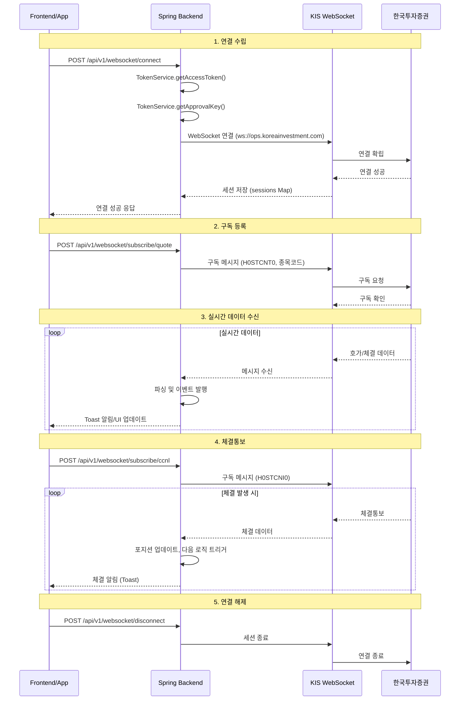
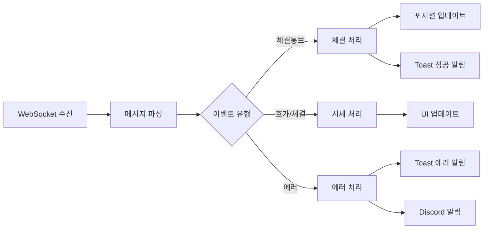

# 다중 계좌 관리 및 실시간 스트리밍 아키텍처

## 1. 개요

### 1.1 목적

이 문서는 **다중 계좌 관리**와 **WebSocket 기반 실시간 스트리밍** 아키텍처를 정의합니다. 로보어드바이저 실전 운영에서 필수적인 다중 계좌 통합 관리, 실시간 호가/체결 데이터 수신, 알림 시스템 연동을 다룹니다.

### 1.2 범위

- 다중 계좌 관리 (증권사별, 모의/실전별 그룹핑)
- 통합 포트폴리오 뷰
- 한국투자증권 WebSocket 실시간 스트리밍
- 알림 시스템 통합

### 1.3 관련 문서

- [12-auto-investment-strategy.md](./12-auto-investment-strategy.md) §8: KIS API 실전 구축 전략
- [09-korea-investment-api-guide.md](../04-api/09-korea-investment-api-guide.md): KIS REST/WebSocket API 가이드

---

## 2. 다중 계좌 관리

### 2.1 현재 구조

기존 `UserAccount` 엔티티가 다중 계좌를 지원하는 구조로 이미 구현되어 있습니다.

```
┌─────────────────────────────────────────────────────────────────┐
│ User (userId)                                                   │
│  ├── UserApiKey (증권사별 API 키)                               │
│  │    ├── UserAccount (계좌 1: 한국투자증권 모의)               │
│  │    ├── UserAccount (계좌 2: 한국투자증권 실전)               │
│  │    └── ...                                                   │
│  ├── UserApiKey (다른 증권사)                                   │
│  │    └── UserAccount (계좌 N)                                  │
│  └── TradingSetting (계좌별 거래 설정)                          │
└─────────────────────────────────────────────────────────────────┘
```

#### UserAccount 엔티티 주요 필드

| 필드 | 설명 |
|------|------|
| `userId` | 계좌 소유자 ID |
| `userApiKeyId` | 사용할 API 키 (증권사별) |
| `brokerType` | 증권사 코드 (KOREA_INVESTMENT 등) |
| `serverType` | "1" 모의투자, "0" 실거래 |
| `isDefault` | 메인 계좌 여부 |
| `isActive` | 활성화 여부 |

### 2.2 계좌 그룹핑 설계

#### 2.2.1 증권사별 그룹핑

```java
// 기존 Repository 메서드 활용
List<UserAccount> findByUserIdAndBrokerType(String userId, BrokerType brokerType);
```

#### 2.2.2 모의/실전별 그룹핑

```java
// serverType 기준 조회
List<UserAccount> findByUserIdAndServerType(String userId, String serverType);
```

#### 2.2.3 계좌 그룹 뷰 (API 응답 설계)

```json
{
  "userId": "user-001",
  "accountGroups": [
    {
      "brokerType": "KOREA_INVESTMENT",
      "brokerName": "한국투자증권",
      "virtual": [
        {"accountId": "acc-001", "accountName": "모의계좌1", "isDefault": false}
      ],
      "real": [
        {"accountId": "acc-002", "accountName": "실전계좌1", "isDefault": true}
      ]
    }
  ],
  "defaultAccount": {
    "accountId": "acc-002",
    "brokerType": "KOREA_INVESTMENT",
    "serverType": "0"
  }
}
```

### 2.3 통합 포트폴리오 뷰

다중 계좌의 자산을 통합하여 보여주는 뷰를 제공합니다.

#### 2.3.1 통합 포트폴리오 API 설계

```
GET /api/v1/portfolio/integrated?userId={userId}

Response:
{
  "totalAssetKrw": 125000000,
  "totalAssetUsd": 95000,
  "accounts": [
    {
      "accountId": "acc-001",
      "accountName": "한투 모의",
      "brokerType": "KOREA_INVESTMENT",
      "serverType": "1",
      "assetKrw": 50000000,
      "assetUsd": 35000,
      "profitLossRate": 5.2
    },
    {
      "accountId": "acc-002",
      "accountName": "한투 실전",
      "brokerType": "KOREA_INVESTMENT",
      "serverType": "0",
      "assetKrw": 75000000,
      "assetUsd": 60000,
      "profitLossRate": 8.7
    }
  ],
  "holdings": {
    "domestic": [
      {"symbol": "005930", "name": "삼성전자", "quantity": 100, "accounts": ["acc-001", "acc-002"]}
    ],
    "overseas": [
      {"symbol": "AAPL", "name": "Apple Inc.", "quantity": 50, "accounts": ["acc-002"]}
    ]
  }
}
```

### 2.4 계좌간 자산 배분

`TradingSetting` 엔티티의 기존 필드를 활용하여 계좌별 자산 배분을 관리합니다.

| 필드 | 설명 |
|------|------|
| `maxInvestmentAmount` | 최대 투자금액 |
| `shortTermRatio` | 단기 비율 (0~1) |
| `mediumTermRatio` | 중기 비율 (0~1) |
| `longTermRatio` | 장기 비율 (0~1) |
| `autoTradingEnabled` | 자동 매매 활성화 |
| `roboAdvisorEnabled` | 로보 어드바이저 활성화 |

---

## 3. WebSocket 실시간 스트리밍

### 3.1 아키텍처 개요



### 3.2 기존 구현 현황

`KoreaInvestmentWebSocketClientImpl`이 이미 핵심 기능을 구현하고 있습니다.

#### 3.2.1 인터페이스 (`KoreaInvestmentWebSocketClient`)

```java
public interface KoreaInvestmentWebSocketClient {
    void connect(String userId, String serverType);
    void disconnect(String userId, String serverType);
    boolean isConnected(String userId, String serverType);
    void subscribeQuote(String userId, String serverType, List<String> symbols);
    void unsubscribeQuote(List<String> symbols);
    void subscribeCcnlNotice(String userId, String serverType);
    void unsubscribeCcnlNotice(String userId, String serverType);
}
```

#### 3.2.2 구현체 주요 특징

| 기능 | 구현 상태 | 설명 |
|------|----------|------|
| 연결 관리 | ✅ 완료 | `sessions` ConcurrentHashMap으로 userId\|serverType별 세션 관리 |
| 연결 간격 제어 | ✅ 완료 | `MIN_CONNECTION_INTERVAL_MS = 1000L` (1초 간격 준수) |
| 토큰 조회 | ✅ 완료 | `KoreaInvestmentTokenService` 연동 |
| approval_key 발급 | ✅ 완료 | REST API로 WebSocket용 approval_key 자동 발급 |
| 호가 구독 | ✅ 완료 | `H0STCNT0` TR_ID로 종목별 구독 |
| 체결통보 구독 | ✅ 완료 | `H0STCNI0` TR_ID로 계좌 체결통보 구독 |
| 구독 해제 | ✅ 완료 | tr_type "2"로 해제 메시지 전송 |
| 재연결 | ✅ 완료 | 연결 끊김 시 지수 백오프로 자동 재연결, 구독 복원 |
| Heartbeat | ✅ 완료 | PINGPONG(tr_type "9") 주기 전송으로 연결 유지 |

### 3.3 KIS WebSocket 스펙

#### 3.3.1 WebSocket URL

| 환경 | URL |
|------|-----|
| 모의투자 | `ws://ops.koreainvestment.com:31000/tryitout` |
| 실전투자 | `ws://ops.koreainvestment.com:21000/tryitout` |

#### 3.3.2 TR_ID (거래 ID)

| TR_ID | 용도 | 설명 |
|-------|------|------|
| `H0STCNT0` | 실시간 체결가 | 국내주식 실시간 체결 데이터 |
| `H0STASP0` | 실시간 호가 | 국내주식 실시간 호가 데이터 |
| `H0STCNI0` | 체결통보 | 주문 체결 Push 알림 |

#### 3.3.3 구독 메시지 포맷

```json
{
  "header": {
    "approval_key": "발급받은_approval_key",
    "custtype": "P",
    "tr_type": "1",
    "content-type": "utf-8"
  },
  "body": {
    "input": {
      "tr_id": "H0STCNT0",
      "tr_key": "005930"
    }
  }
}
```

- `tr_type`: "1" = 구독, "2" = 해제
- `tr_key`: 종목코드 (6자리)

### 3.4 확장 구현 계획

#### 3.4.1 재연결 로직

```pseudocode
ON connection_lost:
    retry_count = 0
    WHILE retry_count < MAX_RETRIES:
        wait(exponential_backoff(retry_count))
        TRY:
            connect()
            resubscribe_all()
            BREAK
        CATCH:
            retry_count++
    IF retry_count >= MAX_RETRIES:
        alert_discord("WebSocket 재연결 실패")
```

#### 3.4.2 Heartbeat 구현

```pseudocode
EVERY 30 seconds:
    IF session.isOpen():
        send_ping()
    ELSE:
        trigger_reconnect()
```

#### 3.4.3 다중 계좌 WebSocket 관리

```
┌────────────────────────────────────────────────────────────┐
│ WebSocket Connection Manager                               │
│                                                            │
│  sessions Map<String, WebSocketSession>                    │
│   ├── "user1|1" → 모의투자 세션                            │
│   ├── "user1|0" → 실전투자 세션                            │
│   └── "user2|1" → 다른 사용자 모의 세션                    │
│                                                            │
│  * 동일 사용자라도 모의/실전 별도 연결                     │
│  * 세션별 구독 종목/체결통보 독립 관리                     │
└────────────────────────────────────────────────────────────┘
```

#### 3.4.4 재연결 후 REST 1회 보정 (옵션)

재연결 성공 후 **갭 구간** 동안 누락된 틱은 복구하지 않는다. 다만 청산/단타 판단에 사용하는 **현재가**는 다음 방식으로 보정된다.

- **현재 동작**: `RealtimeMarketDataService.getCurrentPrice(symbol)` 호출 시 `webSocketLivePrices`에 값이 없으면 즉시 REST API(`marketDataClient.getCurrentPrice`) 호출 후 캐시에 적재. 따라서 재연결 직후 첫 조회부터 REST Fallback으로 최신가를 사용한다.
- **선택적 보정**: 재연결 성공 시 구독 중인 종목에 대해 REST 현재가를 1회 호출해 `webSocketLivePrices`(및 캐시)를 미리 채우는 로직은 **현재 미구현**. 필요 시 `KoreaInvestmentWebSocketClientImpl`의 `restoreSubscriptions` 완료 콜백에서 `RealtimeMarketDataService`에 보정 요청을 넣는 방식으로 도입 가능.

#### 3.4.5 당일 고가(todayHigh) 출처 정책

청산 규칙(ATR Trailing Stop, -3% Trailing 등)에서 사용하는 **당일 고가**는 다음 순서로 결정된다.

- **1순위**: `PipelineExitScheduler`가 `RealtimeMarketDataService.getCurrentPrices()`로 조회한 DTO의 `highPrice`(당일 고가). 동일 API가 WebSocket 수신 데이터가 있으면 WS 기반, 없으면 REST 기반으로 반환하므로 **현재가와 동일한 채널(WS 우선, REST Fallback)**을 사용한다.
- **2순위**: `todayHighBySymbol`이 없거나 해당 종목이 없으면 `ExitRuleService` 내부에서 `DailyStock`(일봉) 당일 고가를 조회해 사용한다.

**재연결/갭 구간**: WS 끊김 구간에는 REST Fallback으로 조회한 현재가·당일 고가가 사용되므로, 끊김 동안의 고가가 REST 1회 조회 시점 기준으로만 반영될 수 있다. 실시간 틱 복구는 하지 않으며, “현재가·당일 고가 기준” Fallback으로 일관성은 유지된다.

#### 3.4.6 WebSocket 수신 → 캐시 반영 및 구독 트리거

**WebSocket 수신 시 캐시 반영 (WebSocketPriceCacheListener)**

- `WebSocketDataEvent` 수신 시 이벤트의 `tr_id`가 설정의 `quote-tr-id`(실시간 호가) 또는 `execution-tr-id`(실시간 체결)와 일치하면 payload(JSON 또는 파이프 구분)에서 종목코드·현재가를 추출한다.
- `CurrentPriceDto`를 생성한 뒤 `RealtimeMarketDataService.updateFromWebSocket(symbol, dto)`를 호출하여 `webSocketLivePrices` 및 Redis 캐시(`CACHE_CURRENT_PRICE`)를 갱신한다.
- 단타/청산 로직에서 `getCurrentPriceBlocking`/`getCurrentPrices` 호출 시 WebSocket으로 수신된 값이 우선 사용된다.

**구독 트리거 (보유·단타 종목)**

- **연결 성공 시**: `KoreaInvestmentWebSocketClientImpl` 연결 성공 후 `restoreSubscriptions(sessionKey)`로 기존에 구독 중이던 종목을 자동 복원한다.
- **스케줄러 실행 시**: `PipelineExitScheduler`·`IntradayBreakoutScheduler`에서 `KoreaInvestmentWebSocketClient`를 `@Autowired(required = false)`로 주입하고, 스케줄 실행 시 평가 대상 종목(보유 포지션·단타 돌파 후보)에 대해 `webSocketClient.isConnected(userId, serverType)`이면 `subscribeQuote(userId, serverType, symbols)`를 호출한다. 이로써 청산/단타 평가 직전에 해당 종목의 실시간 호가·체결 구독이 갱신된다.

**현재가 캐시 TTL**

- `investment.market-data.current-price-cache-ttl-seconds`(기본 300초)로 현재가 캐시 TTL을 제어한다. 단타/청산/WebSocket 활성화 환경에서는 5초 등 짧은 값 설정을 권장한다. (application.yml 및 CacheConfig 참조)

### 3.5 해외주식 실시간 시세 (선택)

해외주식 실시간 시세는 유료 서비스이므로 선택적으로 구현합니다.

| 항목 | 설명 |
|------|------|
| TR_ID | 별도 확인 필요 (MCP 도우미 활용) |
| 비용 | 유료 서비스 |
| 대안 | REST API 주기적 폴링 (현재 구현) |

---

## 4. 알림 통합

### 4.1 알림 종류

| 유형 | 트리거 | 알림 방법 |
|------|--------|----------|
| 체결 알림 | WebSocket 체결통보 수신 | Toast (성공) |
| 리스크 경고 | 일일 손실 한도 도달 | Toast (경고) + Discord |
| 연결 상태 | WebSocket 연결/해제 | Toast (정보) |
| 오류 알림 | 주문 실패, 연결 실패 | Toast (에러) + Discord |

### 4.2 Toast 시스템 연동

기존 구현된 `toast.js` 시스템을 활용합니다.

```javascript
// 체결 알림 예시
Toast.success('체결 완료', '삼성전자 10주 매수 체결');

// 리스크 경고 예시
Toast.warning('리스크 알림', '일일 손실 한도 80% 도달');

// 연결 상태 예시
Toast.info('연결 상태', 'WebSocket 연결됨 (모의투자)');

// 오류 알림 예시
Toast.error('주문 실패', '잔고 부족으로 주문이 거부되었습니다');
```

### 4.3 알림 이벤트 플로우



---

## 5. 구현 계획

### 5.1 설정 (application.yml)

```yaml
investment:
  market-data:
    korea-investment:
      websocket:
        enabled: true
        base-url-real: ws://ops.koreainvestment.com:21000
        base-url-virtual: ws://ops.koreainvestment.com:31000
        path: /tryitout
        quote-tr-id: H0STCNT0
        ccnl-notice-tr-id: H0STCNI0
        connect-wait-ms: 100
        subscription-interval-ms: 100
        approval-key-fetch-enabled: true
        heartbeat-interval-ms: 30000
        reconnect-max-retries: 5
        reconnect-base-delay-ms: 1000
```

### 5.2 구현 우선순위

| 순서 | 항목 | 설명 | 상태 |
|------|------|------|------|
| 1 | WebSocket 연결/구독 | 기본 연결, 호가/체결 구독 | ✅ 완료 |
| 2 | 메시지 파싱 | 수신 데이터 파싱 및 WebSocketDataEvent 발행, WebSocketPriceCacheListener에서 수신 시 현재가 갱신 연동됨 | ✅ 완료 |
| 3 | 재연결 로직 | 연결 끊김 시 자동 재연결 | ✅ 완료 |
| 4 | Heartbeat | 연결 유지용 ping/pong | ✅ 완료 |
| 5 | WebSocket → 단타/청산 연동 | 이벤트 리스너에서 현재가 반영, RealtimeMarketDataService.getCurrentPriceBlocking에서 webSocketLivePrices 우선 조회·REST fallback | ✅ 완료 |
| 6 | 알림 연동 | Toast/Discord 알림 발송 | ⏳ 구현 필요 |
| 7 | 통합 포트폴리오 API | 다중 계좌 자산 통합 조회 | ⏳ 구현 필요 |

### 5.3 테스트 계획

| 테스트 유형 | 대상 | 검증 항목 |
|-------------|------|----------|
| 단위 테스트 | WebSocketClientImpl | 메시지 생성, 파싱 |
| 통합 테스트 | 모의투자 연결 | 연결/구독/수신 |
| E2E 테스트 | 체결통보 | 주문 → 체결 → 알림 |

### 5.4 재연결·Fallback 검증 시나리오

실전 배포 전 체크리스트([plans/qa/실전_배포_전_필수_확인_체크리스트.md](../../../plans/qa/실전_배포_전_필수_확인_체크리스트.md)) 대응용 검증 시나리오이다.

| 시나리오 | 절차 | 기대 결과 |
|----------|------|-----------|
| **재연결** | WS 수동 끊기 → 재연결 및 `restoreSubscriptions` 대기 → 해당 종목에 대해 `RealtimeMarketDataService.getCurrentPrice(symbol)` 호출 | 재연결 후 첫 조회 시 `webSocketLivePrices` 미갱신이면 REST 호출 발생·캐시 갱신. 이후 WS 수신 재개 시 WS 값으로 전환. |
| **Fallback(비구독/WS 비활성)** | WS 비구독 종목 또는 `websocket.enabled=false` 상태에서 `getCurrentPrice`/`getCurrentPrices` 호출 | REST API 호출·5분 TTL 캐시 응답. Circuit Breaker fallback 시 null 등 정의된 동작. |
| **당일 고가 출처** | `PipelineExitScheduler` 실행 시 보유 종목에 대해 `getCurrentPrices()` → `getSellSignals(..., currentPriceBySymbol, todayHighBySymbol)` | todayHigh는 동일 채널(WS 우선·REST Fallback)의 DTO `highPrice` 사용. 미제공 시 DailyStock 당일 고가 fallback. |

---

## 6. 참고

### 6.1 Rate Limit 주의사항

- **WebSocket 연결 간격**: 최소 1초
- **모의투자 API 호출**: 1초당 2건
- **실전투자 API 호출**: 1초당 약 20건

### 6.2 보안 고려사항

- Access Token, Approval Key 로그 마스킹 (`LogMaskingUtil`)
- 계좌번호 암호화 저장 (`accountNoEncrypted`)
- .env에 실제 키 저장 금지

---

## 문서 변경 이력

| 버전 | 일자 | 작성자 | 변경 내용 |
|------|------|--------|----------|
| 1.0 | 2026-02-20 | System | 초기 설계 문서 작성 — 다중 계좌 관리, WebSocket 스트리밍, 알림 통합 |
