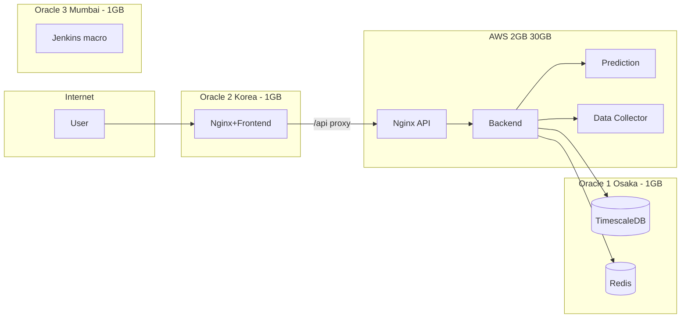

# 멀티 VPS 배포 (Oracle Cloud 2대 + AWS Free Tier 1대) 및 CI/CD

## 개요

이 문서는 **Oracle Cloud 2~3대**(VM.Standard.E2.1.Micro, 1 OCPU / 1GB RAM)와 **AWS 1대**(2GB RAM, 30GB EBS 권장)를 활용한 멀티 VPS 배포 토폴로지, 메모리 튜닝, CI/CD 파이프라인, 보안 및 체크리스트를 정리한다.

- **현재 구성**: OCI는 **Oracle Osaka**(데이터)·**Oracle Korea**(엣지 또는 앱)·**India West (Mumbai)**(매크로 전용). **AWS = API 계층**(Backend, prediction-service, data-collector, nginx api) — 2GB RAM, 30GB EBS 인스턴스 사용 시. Oracle 2/3 = 엣지(Frontend, nginx) 또는 기존 앱 계층.
- **Compose 파일명**: region-role 구분. `docker-compose.oracle1-osaka-data.yml`, `docker-compose.oracle2-korea-app.yml`, `docker-compose.oracle3-mumbai-macro.yml`, `docker-compose.aws-seoul-api.yml`. [scripts/README.md](https://github.com/Layton0-0/investment-infra/blob/main/scripts/README.md) 참조.
- **모니터링**: 노드별 메모리·컨테이너 확인은 `investment-infra/scripts/monitor-node-resources.sh` 실행 (수동 또는 cron).
- **로컬 데스크탑**: 토폴로지 포함 2안은 [12-local-desktop-topology-options.md](12-local-desktop-topology-options.md) 참조.
- **VCN/서브넷 설계**: 리전별 VCN·서브넷·Security List 상세는 [06-oci-vcn-subnet-design.md](06-oci-vcn-subnet-design.md) 참조.
- **단일 VPS 배포**: [06-single-vps-batch-deployment.md](../08-setup-guides/06-single-vps-batch-deployment.md) 참조.
- **인프라 저장소**: [investment-infra](../../../investment-infra/README.md).

---

## 1. 인프라 스펙

| 리소스   | 별칭(예)   | 스펙                                       | 비고                          |
|----------|------------|--------------------------------------------|-------------------------------|
| Oracle 1 | Oracle Osaka | 1 OCPU, 1GB RAM, Public IP·Private IP 각 1개 (문서에 실제 값 기입 금지) 50GB volume | Always Free (E2.1.Micro)      |
| Oracle 2 | Oracle Korea | 1 OCPU, 1GB RAM, Public IP 1개 (문서에 실제 값 기입 금지)    50GB volume         | Always Free                   |
| Oracle 3 | India West (Mumbai) | 1 OCPU, 1GB RAM, Public IP 1개 (문서에 실제 값 기입 금지)    100GB volume    | Always Free (E2.1.Micro, 증설) |
| AWS      | AWS 서울 (API 계층) | **2GB RAM, 30GB EBS** (t3.small / **t3a.small** 권장) | API 스택 전용. t3a.small은 x86·비용 약 10% 절감. |

- 실제 IP·호스트명·키 경로는 저장소·문서에 넣지 않는다.
- **AWS 인스턴스 권장**: API 스택(Backend, prediction, data-collector, nginx)을 올릴 때는 **t3a.small**(2 vCPU, 2GB RAM, x86) 또는 t3.small 권장. 2GB·30GB는 현재 설계와 동일. 배포/접속 시 본인 환경 값만 사용한다.
- 1GB × 2~3노드 제약이 있으므로 서비스별 역할 분리와 메모리 튜닝이 필수이다.

### 1.4 Oracle 3 (Mumbai) 프로비저닝 현황

| 항목 | 값 |
|------|-----|
| 리전 | ap-mumbai-1 (India West) |
| VCN | aifer-vcn |
| Shape | VM.Standard.E2.1.Micro (1 OCPU, 1GB RAM) |
| OS | Canonical Ubuntu 24.04 |
| 사용자 | ubuntu |
| 부트 볼륨 | 100 GB (기본) |
| 프로비저닝 일자 | 2026-02-11 |

Public IP는 OCI 콘솔에서 확인 후, GitHub Variables `DEPLOY_HOST_ORACLE_MUMBAI` 및 Oracle 1(Osaka) Security List(5432/6379) 허용에만 사용한다. 문서에는 기입하지 않는다.

---

## 2. 노드 역할 분리

**정책**: 무거운 워크로드(API 스택)는 AWS, OCI 1GB 노드는 데이터·엣지·매크로만 담당한다.

### 2.1 토폴로지 다이어그램



### 2.2 노드별 역할

| 노드     | 별칭(예)   | 역할                                      | 서비스 |
|----------|------------|-------------------------------------------|--------|
| Oracle 1 | Oracle Osaka | 데이터 계층                               | TimescaleDB, Redis |
| AWS      | AWS 서울     | **API 계층** (2GB RAM, 30GB EBS)          | Backend, prediction-service, data-collector, nginx(api) |
| Oracle 2 | Oracle Korea | **엣지** (Frontend + nginx)               | Frontend, nginx — /api는 AWS로 프록시 |
| Oracle 3 | India West (Mumbai) | **매크로 전용**                         | Jenkins (token-macro 등) |

- **Oracle 1 (Osaka)**: DB·Redis만 운영. **단일 장애점(SPOF)** — 해당 노드 장애 시 전체 API 불가. 스왑·백업·복구 절차 필수. Oracle 2/3·AWS는 Oracle 1 **Public IP**로 5432/6379 접속.
- **AWS**: API 스택 전부. Backend가 Oracle 1(Osaka) Public IP로 DB/Redis 접속. **api.*** 도메인 → AWS Public IP.
- **Oracle 2 (Korea)**: 엣지 전환 시 Frontend + nginx만. `/api` 요청은 AWS API 서버로 proxy_pass. **app.*** 도메인. (기존 앱 계층 유지 시에는 Backend 등 Oracle 2에서 운영.)
- **Oracle 3 (Mumbai)**: **매크로 전용.** Jenkins만 운영. 앱 스택은 배포하지 않음.

### 2.3 SSH로 수행할 작업 (매크로 이전·정리)

매크로를 Mumbai로 통합한 뒤, 각 노드에서 아래를 실행한다. (Cursor/Agent가 SSH MCP로 수행하거나, 수동 SSH로 동일 명령 실행.)

| 노드 | 작업 | 비고 |
|------|------|------|
| **Oracle 1 (Osaka)** | Jenkins 컨테이너·이미지 제거 | `docker ps -a` / `docker images \| grep jenkins` 후 `docker rm`·`docker rmi`. **완료 예시**: Jenkins 이미지 `docker-compose_jenkins:latest` 제거 완료. |
| **Oracle 2 (Korea)** | Jenkins 컨테이너·이미지가 있으면 제거 | 동일 방식. 접속 불가 시 접속 가능해지면 실행. |
| **Oracle 3 (Mumbai)** | ① `investment-infra` 최신 반영 (`git pull`) ② `./jenkins_home` 준비 (비어 있거나 Osaka에서 rsync/scp로 복사) ③ `./scripts/deploy-oracle3-mumbai.sh` 실행 | 매크로 전용 compose `docker-compose.oracle3-mumbai-macro.yml` 사용. [setup-oracle3-mumbai.sh](https://github.com/Layton0-0/investment-infra/blob/main/scripts/setup-oracle3-mumbai.sh) Next steps 참조. |

- Korea·Mumbai SSH 타임아웃 시: 네트워크/방화벽 확인 후 동일 명령을 수동으로 실행하면 된다.

### 2.4 리소스 타이트 시 대안

- Oracle 2에서 **prediction-service** 또는 **data-collector** 중 하나만 기동하고, 나머지는 Backend 설정에서 URL 비활성 또는 스킵.
- 또는 AWS에 prediction-service만 두고 Oracle 2에는 Backend + data-collector만 두는 구성으로 조정 가능.

---

## 3. 메모리 튜닝

### 3.0 스왑 설정 (모든 노드)

**RAM 용량을 고려한 스왑 증설 정책**: 데이터 노드(Oracle 1)는 2GB 이상 권장(실제 10GB 적용 사례 있음). 1GB 앱/엣지 노드(Oracle 2·3)는 2GB, 2GB 노드(AWS API 계층)는 2GB 권장. 모든 노드에서 OOM 방지를 위해 스왑을 보수적으로 설정한다.

1GB 노드(Oracle 1·2·3)는 기본 시스템만으로 약 400MB 사용이 예상되므로, **OOM 방지를 위해 모든 서버에서 스왑을 보수적으로 설정**한다. AWS(2GB)도 피크 완충을 위해 스왑 권장.

#### 노드별 스왑 현황 (확인 일자: 2026-02-19)

| 노드 | 별칭(예) | 권장 스왑 | 확인 결과 | 비고 |
|------|----------|-----------|-----------|------|
| Oracle 1 | Oracle Osaka | 2GB 이상 | **10GB** 적용됨 | 기존 설정 유지. |
| Oracle 2 | Oracle Korea | **2GB** | **2GB** 적용됨 | 유지. |
| Oracle 3 | India West (Mumbai) | **2GB** | SSH 타임아웃으로 미확인 | 접속 가능 시 아래 절차로 2GB 적용 권장. |
| AWS | AWS 서울 (API 계층) | **2GB** | **2GB** 적용됨 (당일 적용) | 보수적 완충용. |

- 확인 명령: `free -m`, `swapon --show`

#### 스왑 설정 절차 (미적용 노드 또는 신규 노드)

아래는 **root 또는 sudo** 로 한 번만 실행한다. 기존 `/swapfile`이 있으면 크기만 확인하고, 없거나 부족하면 새로 생성한다.

```bash
# 2GB 스왑 파일 생성 (보수적으로 넉넉히; 필요 시 4G로 변경 가능)
sudo fallocate -l 2G /swapfile
sudo chmod 600 /swapfile
sudo mkswap /swapfile
sudo swapon /swapfile

# 재부팅 후에도 유지
grep -q '/swapfile' /etc/fstab || echo '/swapfile none swap sw 0 0' | sudo tee -a /etc/fstab
```

- **확인**: `free -m` 에서 Swap 행에 2048(또는 설정한 용량) 표시.
- 상세·트러블슈팅: [04-minimal-cost-setup.md](04-minimal-cost-setup.md) § 메모리 부족 시 참조.

### 3.1 Oracle 1 (TimescaleDB + Redis)

- **SPOF 주의**: Oracle 1은 데이터 계층의 **단일 장애점(SPOF)** 이다. 해당 노드 장애 시 API·엣지가 정상이어도 서비스 불가. 스왑·백업·복구 runbook([13-oracle1-recovery-runbook.md](13-oracle1-recovery-runbook.md)) 필수.

| 구성 요소   | 권장 설정 | 비고 |
|-------------|-----------|------|
| TimescaleDB | **`shared_buffers = 128MB`**, `max_connections = 20` | 1GB 노드에서 256MB는 위험. 128MB로 안전하게 운영. |
| Redis       | `maxmemory 128mb`, `maxmemory-policy allkeys-lru` | 256MB까지 가능하나 128MB로 시작 권장. AOF 권장(appendonly yes). |
| 스왑        | **2GB** 스왑 파일 권장 | OOM 방지. |

### 3.2 Oracle 2 (Backend + prediction + data-collector)

| 구성 요소        | 권장 설정 | 비고 |
|------------------|-----------|------|
| Backend JVM      | `-Xms256m -Xmx512m` | 1GB 노드에서 Heap 상한 512MB |
| prediction-service | Docker `mem_limit: 256m` | 필요 시 128m으로 축소 |
| data-collector   | Docker `mem_limit: 256m` | 필요 시 128m으로 축소 |

동시에 셋을 모두 올리면 1GB를 초과할 수 있으므로, 초기에는 prediction 또는 data-collector 중 하나만 기동하거나, 둘 다 128MB limit으로 모니터링 후 조정한다.

### 3.3 AWS (API 스택)

- **2GB RAM, 30GB EBS** 기준: Backend(-Xmx384m) + prediction + data-collector + nginx(api) ≈ 850MB~1.3GB. 2GB면 여유 있음. 인스턴스는 **t3a.small**(x86, 비용 약 10% 절감) 또는 t3.small 권장.

---

## 4. 네트워크

- **동일 VCN 불가**: Oracle Osaka, Korea, India West (Mumbai)는 **서로 다른 리전**이므로 동일 VCN을 쓸 수 없다. OCI VCN은 리전 단위. 상세 설계는 [06-oci-vcn-subnet-design.md](06-oci-vcn-subnet-design.md) 참조.
- **Oracle 1 ↔ Oracle 2 / Oracle 3 / AWS**: **Public IP**로 통신. Backend(또는 AWS API 스택)의 DB/Redis 연결 URL을 **Oracle 1(Osaka) Public IP**로 설정. Oracle 1 Security List에서 Oracle 2·Oracle 3(Mumbai)·**AWS Public IP**를 5432, 6379 Ingress 허용에 **반드시** 추가. ([06-oci-vcn-subnet-design.md](06-oci-vcn-subnet-design.md) §3.1)
- **엣지 → API**: Oracle 2/3 Nginx가 `/api` 요청을 AWS API 서버(Backend)로 프록시할 때 AWS **Public IP** 또는 **api.*** 도메인 사용.
- **방화벽**: Oracle 1의 5432(TimescaleDB), 6379(Redis)는 Oracle 2·Oracle 3(Mumbai)·**AWS** **Public IP**에서만 접근 허용. SSH(22), HTTP(80), HTTPS(443)는 운영 정책에 따라 제한.

---

## 5. CI 파이프라인 (GitHub Actions 권장)

- 1GB 노드에 Jenkins를 두기 부담되므로 **GitHub Actions**를 기본 옵션으로 권장.
- **레지스트리**: `ghcr.io/<owner>/investment-*` (docker-compose.prod.yml의 `REGISTRY`, `*_TAG` 환경 변수 사용).

### 5.1 단계

1. **Checkout**: 메인/배포 브랜치 체크아웃.
2. **Build & Test**
   - Backend: `./gradlew test bootJar`
   - Frontend: `npm ci && npm run build && npm run test -- --run`
   - prediction-service: `pip install -r requirements.txt && pytest tests/ -v`
   - data-collector: 동일하게 빌드·테스트
3. **Docker Build & Push**
   - 각 서비스별 Dockerfile로 이미지 빌드.
   - 태그: `git commit SHA` 7자리 또는 `latest`.
   - `ghcr.io/<owner>/investment-backend:<tag>` 등으로 푸시 (GITHUB_TOKEN 또는 PAT).

### 5.2 트리거

- CI: PR/푸시 시 빌드·테스트·이미지 푸시.
- CD: `main`(또는 `release`) 푸시 시, 또는 태그 푸시(예: `deploy/v1.0.1`) 시 배포 job 실행.

### 5.3 사용 시크릿 (예시)

**보안**: SSH 비밀키는 **저장소 코드/문서에 절대 커밋하거나 붙여넣지 않는다.** 아래는 **GitHub 저장소 설정 → Secrets and variables → Actions** 에서 등록하는 **Secrets** 이름이다. Secrets는 GitHub이 암호화·보관하며, 워크플로우 실행 시에만 러너 메모리로 전달되고 로그에는 마스킹된다. (CD를 쓰지 않으면 Secrets 등록 없이 로컬에서 SSH + 배포 스크립트만 사용하면 된다.)

| 시크릿 이름 | 용도 |
|-------------|------|
| `GITHUB_TOKEN` | ghcr.io 푸시 (기본 제공) |
| `SSH_PRIVATE_KEY_ORACLE_OSAKA` | Oracle Osaka(Oracle 1) 배포용 SSH 비밀키 **내용** — Settings → Actions → Secrets에만 등록 |
| `SSH_PRIVATE_KEY_ORACLE_KOREA` | Oracle Korea(Oracle 2) 배포용 SSH 비밀키 **내용** — 동일 |
| `SSH_PRIVATE_KEY_ORACLE_MUMBAI` | India West (Mumbai)(Oracle 3) 배포용 SSH 비밀키 **내용** — 동일 |
| `SSH_PRIVATE_KEY_AWS` | AWS 배포 SSH (AWS 사용 시) |

---

## 6. CD 파이프라인 (배포)

- **원칙**: 이미지 tag만 참조. 각 노드에서 `docker compose pull` 후 해당 서비스만 `up -d` 재기동.

### 6.1 노드별 CD 동작

| 노드     | CD 시 할 일 |
|----------|-------------|
| Oracle 1 | `docker compose -f docker-compose.oracle1-osaka-data.yml pull` (필요 시) 후 `up -d`. DB/Redis는 버전 고정 태그 사용 권장. |
| Oracle 2 | `BACKEND_TAG=<sha>` 등 env 설정 후 `docker compose -f docker-compose.oracle2-korea-app.yml pull backend prediction-service data-collector nginx && up -d`. `deploy-oracle2.sh` 사용. |
| Oracle 3 (Mumbai) | **매크로만.** `deploy-oracle3-mumbai.sh` → `docker-compose.oracle3-mumbai-macro.yml` (Jenkins). 앱 스택 없음. |
| AWS (API 계층) | `.env`에 Oracle 1 Public IP(SPRING_DATASOURCE_URL, REDIS_HOST) 설정 후 `deploy-aws-api-stack.sh` — `docker-compose.aws-seoul-api-stack.yml` (backend, prediction-service, data-collector, nginx). |
| AWS (엣지만)   | `FRONTEND_TAG=<sha>` 로 env 설정 후 `docker compose -f docker-compose.aws-seoul-api.yml pull frontend nginx && up -d`. |

### 6.2 배포 순서

1. Oracle 1 (DB·Redis) — 변경이 있을 때만.
2. Oracle 2 (Backend, prediction-service, data-collector, nginx).
3. Oracle 3 (Mumbai) (매크로: Jenkins만).
4. AWS (Frontend, Nginx).

### 6.3 Compose 파일 분리 (옵션 B)

- 노드별 파일: `docker-compose.oracle1-osaka-data.yml`, `docker-compose.oracle2-korea-app.yml`, `docker-compose.oracle2-korea-edge.yml`(엣지 전용), `docker-compose.oracle3-mumbai-macro.yml`, `docker-compose.aws-seoul-api.yml`, `docker-compose.aws-seoul-api-stack.yml`(AWS API 계층) (investment-infra 루트). 파일명으로 region-role 구분.
- 각 파일에는 해당 노드에서 기동할 서비스만 정의. 이미지 태그는 환경 변수로 주입.
- **Oracle 2/3 엣지 전환**: API를 AWS로 이전한 뒤 Oracle 2(·3)에서 Backend·prediction·data-collector 제거 시 `docker-compose.oracle2-korea-edge.yml` + `deploy-oracle2-edge.sh` 사용. nginx는 `nginx/conf.d.edge/edge-app.conf`만 로드하며, **location /api** 는 AWS(api.\* 도메인)로 proxy_pass. app.\* DNS는 Oracle 2 또는 3 Public IP.
- 배포 스크립트: `deploy-oracle1.sh`, `deploy-oracle2.sh`, `deploy-oracle2-edge.sh`, `deploy-aws-api-stack.sh`, `deploy-aws.sh`, `set-env-tags.sh`. 사용법은 [scripts/README.md](../../../investment-infra/scripts/README.md) 참조.

### 6.4 롤백

- 이전에 성공 배포한 이미지 태그(이전 커밋 SHA)를 `*_TAG`에 넣고 동일 CD 단계를 재실행.
- 롤백에 사용할 태그는 GitHub Actions 아티팩트, 릴리스 메타데이터, 또는 수동 기록으로 관리.

---

## 7. 보안

- **SSH**: 배포용 **비밀키**는 저장소 코드/문서에 넣지 않는다. GitHub Actions를 쓸 때만 **Settings → Secrets**에 등록(암호화 저장). 노드에는 배포용 **공개키**만 등록.
- **방화벽**: 22(SSH), 80(HTTP), 443(HTTPS)만 필요 시 개방. DB(5432), Redis(6379)는 Oracle 2·Oracle 3(Mumbai)(및 필요 시 AWS) Public IP만 허용. [06-oci-vcn-subnet-design.md](06-oci-vcn-subnet-design.md) §3 참조.
- **시크릿**: 비밀번호·API 키·DB URL 등은 저장소에 커밋하지 않는다. 노드별 `.env` 또는 GitHub Secrets → 배포 시 주입.

---

## 8. 배포 전·후 체크리스트

### 배포 전

- [ ] **스왑**: 1GB OCI 노드(Oracle 1·2·3) 및 AWS에서 스왑 2GB 이상 설정·활성화 확인 (`free -m`, §3.0 참조).
- [ ] DB·Redis 접속 정보 및 방화벽 허용 (Oracle 1 → Oracle 2, Oracle 3 Mumbai, **AWS** Public IP). [06-oci-vcn-subnet-design.md](06-oci-vcn-subnet-design.md) §3.1.
- [ ] Oracle 1 복구 runbook: [13-oracle1-recovery-runbook.md](13-oracle1-recovery-runbook.md).
- [ ] 한국투자증권 API·계좌 설정(모의/실전 구분). **배포·테스트는 모의계좌만 사용**
- [ ] `PIPELINE_AUTO_EXECUTE`, `PIPELINE_ALLOW_REAL_EXECUTION` 등 환경 변수 확인
- [ ] Discord Webhook URL(미체결·리스크 알림 사용 시)
- [ ] 타임존: 스케줄은 Asia/Seoul 기준

### 배포 후

- [ ] Backend 헬스: `GET https://<oracle2-public>/actuator/health`
- [ ] 스케줄 현황: `GET https://<oracle2-public>/batch/api/jobs` (인증 필요)
- [ ] Flyway 마이그레이션: Backend 기동 시 자동 적용. 실패 시 로그 확인
- [ ] 프론트 접속: `https://<aws-public>/` → Nginx가 Backend로 프록시되는지 확인

---

## 9. Cursor Remote-SSH로 OCI 접속

Cursor에서 OCI 서버(Oracle 1 / Oracle 2 / Oracle 3 Mumbai)에 직접 붙어 원격 폴더를 열고, 파일 편집·터미널·Agent 작업을 하려면 Remote-SSH를 사용한다.

### 9.1 전제 조건

- OCI VM **Public IP** 및 **SSH(22)** 접속 가능(방화벽 허용).
- **SSH 비밀키**: OCI 인스턴스에 등록된 키(예: `id_rsa`, `id_ed25519` 또는 `.pem`). **저장소/문서에 키 내용을 넣지 않는다.**
- **OS 사용자**: Oracle Linux → `opc`, Ubuntu → `ubuntu`. 사용 중인 이미지에 맞게 적용.
- Windows: **OpenSSH 클라이언트** 설치 확인(`ssh -V`). 없으면 설정 > 앱 > 선택적 기능에서 OpenSSH 클라이언트 추가.

### 9.2 Cursor 확장

- Cursor 확장에서 **Remote - SSH** 검색 후 설치.
- **Cursor 전용** Remote-SSH 확장(`anysphere.remote-ssh`) 사용 권장(VSCode `ms-vscode-remote.remote-ssh` 대신).

### 9.3 SSH Config (Windows)

**파일**: `C:\Users\<사용자명>\.ssh\config`

Oracle Osaka / Oracle Korea / India West (Mumbai) 예시(실제 IP·키 경로는 본인 환경으로 교체). **HostName**에는 꺾쇠괄호를 넣지 말고 **Public IP 또는 호스트명(도메인)**을 쓴다. 호스트명 사용 시 DNS가 해당 노드 IP로 풀이되어야 한다. 자세한 도메인·DNS 설정은 [11-dns-and-domain-setup.md](11-dns-and-domain-setup.md) 참조.

```text
# Oracle Osaka (데이터 계층: DB/Redis)
Host oci-osaka-yoon
    HostName YOUR_ORACLE_OSAKA_PUBLIC_IP
    User ubuntu
    IdentityFile "YOUR_SSH_KEY_PATH_OSAKA"
    ServerAliveInterval 30
    ServerAliveCountMax 5

# Oracle Korea (애플리케이션 계층: Backend/Prediction/Data-collector)
Host oci-korea-jihee
    HostName YOUR_ORACLE_KOREA_PUBLIC_IP
    User ubuntu
    IdentityFile "YOUR_SSH_KEY_PATH_KOREA"
    ServerAliveInterval 30
    ServerAliveCountMax 5

# India West Mumbai (애플리케이션 계층, Oracle 3)
Host oci-mumbai
    HostName YOUR_ORACLE_MUMBAI_PUBLIC_IP
    User ubuntu
    IdentityFile "YOUR_SSH_KEY_PATH_MUMBAI"
    ServerAliveInterval 30
    ServerAliveCountMax 5
```

- `HostName`: 각 VM의 Public IP 또는 호스트명(예: api.example.com). 호스트명 사용 시 DNS 풀이 필요 ([11-dns-and-domain-setup.md](11-dns-and-domain-setup.md)).
- `User`: Oracle Linux `opc`, Ubuntu `ubuntu`.
- `IdentityFile`: 실제 비밀키 경로(예: `~/.ssh/oci_oracle.pem`). **경로에 공백이 있으면 반드시 큰따옴표로 감싼다**(예: `IdentityFile "D:/OneDrive - HKNC/path/to/key.key"`). 그렇지 않으면 "keyword identityfile extra arguments at end of line" 오류로 SSH가 config를 거부한다.
- `ServerAliveInterval` / `ServerAliveCountMax`: 연결 끊김 방지.
- Host 별칭은 예: `oci-oracle1`/`oci-oracle2` 또는 `oci-osaka-yoon`/`oci-korea-jihee` 등으로 둘 수 있다. SSH MCP 서버 이름과 맞추려면 [07-cursor-oci-ssh-mcp.md](../08-setup-guides/07-cursor-oci-ssh-mcp.md)의 `ssh-mcp-oracle-osaka-yoon` / `ssh-mcp-oracle-korea-jihee`와 대응되게 `oci-osaka-yoon` / `oci-korea-jihee`로 두면 편하다.

### 9.4 Cursor에서 접속 절차

1. **Ctrl+Shift+P** → "Remote-SSH: Connect to Host…" 선택.
2. 목록에서 `oci-osaka-yoon`, `oci-korea-jihee`, 또는 `oci-mumbai` 선택.
3. 비밀키 패스프레이즈 입력(설정한 경우).
4. 연결 후 **열 폴더** 선택:
   - **Oracle Osaka**: `/home/ubuntu`(Ubuntu 이미지) 또는 investment-infra 클론 경로(예: `/home/ubuntu/investment-infra`). DB·Redis 설정·Compose 편집 시 사용.
   - **Oracle Korea**: `/home/ubuntu` 아래 investment-infra/ 앱 코드 경로. Backend/prediction/data-collector 배포·로그·스크립트 작업 시 사용.
   - **Oracle 3 (Mumbai)**: `/home/ubuntu` 아래 investment-infra/ 경로. Oracle Korea와 동일 용도.
5. 해당 호스트가 원격 워크스페이스로 열리면, 터미널·파일 편집·Agent 모두 그 서버에서 동작한다.

### 9.5 Mumbai (Oracle 3) 노드 초기 설정 (최초 1회)

Mumbai E2 인스턴스(ap-mumbai-1, VCN aifer-vcn, Ubuntu 24.04, 사용자 ubuntu)를 처음 쓸 때 한 번만 수행한다. **실제 IP·키·비밀번호는 저장소에 넣지 않는다.**

1. **Oracle 1(Osaka) Security List**: Mumbai 인스턴스의 **Public IP**를 TCP 5432, 6379 Ingress 허용에 추가. ([06-oci-vcn-subnet-design.md](06-oci-vcn-subnet-design.md) §3.1)
2. **Mumbai 서버에 SSH 접속** 후 아래 중 하나 실행.
   - **자동 스크립트**(권장): `investment-infra/scripts/setup-oracle3-mumbai.sh` — Docker·Docker Compose 설치, investment-infra 클론, `.env` 템플릿 안내.
   - **수동**: Docker 및 Docker Compose 설치 → `git clone` investment-infra → `.env`에 `SPRING_DATASOURCE_URL`, `POSTGRES_PASSWORD`, `REDIS_HOST`(Oracle 1 Public IP), `BACKEND_TAG` 등 설정.
3. **GitHub Actions 사용 시**: 저장소 Variables에 `DEPLOY_HOST_ORACLE_MUMBAI` = Mumbai Public IP, Secrets에 `SSH_PRIVATE_KEY_ORACLE_MUMBAI` 등록(비밀키 내용은 Settings에서만 입력).

### 9.6 노드별 작업 요약

| 노드          | Cursor에서 주로 하는 작업 |
|---------------|---------------------------|
| Oracle Osaka  | DB/Redis Compose·설정 변경, 스크립트 실행, 로그 확인 |
| Oracle Korea  | Backend/prediction/data-collector 배포·재기동, 로그·환경 변수 확인, investment-infra 스크립트 실행 |
| Oracle 3 (Mumbai) | Oracle Korea와 동일. 배포·재기동, 로그·환경 변수 확인. `.env`에 Oracle 1 Public IP로 DB/Redis 연결 설정. |

### 9.7 Windows: SSH config 권한 오류 해결

Remote-SSH 연결 시 **"Bad owner or permissions on C:\\Users\\\<사용자명>\\.ssh\\config"** 또는 **"Try removing permissions for user: UNKNOWN\\\\UNKNOWN"** 가 나오면, OpenSSH가 config 파일의 권한을 거부한 것이다. Windows에서는 해당 파일(또는 `.ssh` 폴더)에 다른 사용자/상속된 권한이 있으면 발생한다.

**해결 절차**(PowerShell을 **관리자 권한**으로 실행 후):

1. **권한 문자열을 변수로 지정** (PowerShell이 `(OI)(CI)F` 또는 `USERNAME:F`를 잘못 쪼개지 않도록):

```powershell
$me = $env:USERNAME
$permFolder = "${me}:(OI)(CI)F"
$permFile   = "${me}:F"
```

2. **.ssh 폴더** — 상속 제거 후 현재 사용자 권한 추가. 권한 문자열은 **반드시 따옴표로 한 덩어리**로 넘긴다 (`<사용자명>`은 실제 로그인 이름, 예: HNW):

```powershell
icacls "$env:USERPROFILE\.ssh" /inheritance:r
icacls "$env:USERPROFILE\.ssh" /grant "<사용자명>:(OI)(CI)F"
```

3. **config 파일** — **takeown 직후** 같은(관리자) 창에서 icacls 실행. 권한 문자열을 따옴표로 한 덩어리로:

```powershell
takeown /f "$env:USERPROFILE\.ssh\config"
icacls "$env:USERPROFILE\.ssh\config" /inheritance:r
icacls "$env:USERPROFILE\.ssh\config" /grant "<사용자명>:F"
```

4. **비밀키 파일** (경로·`<사용자명>` 본인 값으로):

```powershell
icacls "D:\path\to\ssh-key-1.key" /inheritance:r
icacls "D:\path\to\ssh-key-1.key" /grant "<사용자명>:F"
icacls "D:\path\to\ssh-key-2.key" /inheritance:r
icacls "D:\path\to\ssh-key-2.key" /grant "<사용자명>:F"
```

- **참고**: 변수(`$permFile`)를 쓰면 "매개 변수가 잘못되었습니다"가 나올 수 있다. 권한은 **따옴표로 감싼 한 문자열**로 넣는다(예: `/grant "HNW:F"`).

5. **확인**: `ssh -T oci-osaka-yoon` 으로 접속 테스트. 권한 오류 없이 패스워드/키 입력 단계로 넘어가면 성공.

6. **OneDrive 등 동기화 폴더**에 `.ssh`를 두었다면, 동기화가 권한을 바꿀 수 있다. 가능하면 `.ssh`는 사용자 프로필(`C:\Users\<사용자명>\.ssh`)에 두고, 키 파일만 다른 드라이브를 쓰는 편이 안정적이다.

### 9.8 "Failed to install server within the timeout" 해결

Remote-SSH로 접속 시 **"Waiting for server to install. Timeout: 30000ms"** 후 **"Failed to install server within the timeout"** 가 나오면, Cursor가 원격에 Cursor 서버를 설치하는 단계에서 30초 안에 완료되지 않은 것이다. OCI처럼 해외/고지연 환경에서는 자주 발생할 수 있다.

**조치 순서:**

1. **SSH 접속 자체 확인**  
   터미널에서 `ssh -T oci-korea-jihee` 실행. 접속·쉘 프롬프트까지 정상이면 SSH는 동작 중이다.

2. **Cursor 연결 타임아웃 늘리기**  
   Cursor **설정**(Ctrl+,) → 우측 상단 `settings.json` 열기 → 다음 추가 또는 수정:
   ```json
   "remote.SSH.connectTimeout": 300
   ```
   (단위: 초. 300 = 5분. 느린 네트워크면 600 등으로 더 늘려도 됨.)

3. **네트워크·VPN 점검**  
   Tailscale·WireGuard 등 VPN 사용 시 최신 버전으로 업데이트 후 재시도. 포럼 사례에선 VPN 업데이트 후 해결된 경우가 있다. 회사 프록시가 있다면 `remote.SSH.httpProxy` / `remote.SSH.httpsProxy` 설정 여부 확인.

4. **재시도**  
   타임아웃 늘린 뒤 Remote-SSH로 다시 접속. 최초 1회는 원격 서버 다운로드 때문에 1~3분 걸릴 수 있다.

5. **임시 스크립트 삭제 실패(EBUSY)**  
   로그에 `Error deleting random file ... cursor_remote_install_*.sh: EBUSY` 가 나와도 연결 실패와는 무관하다. Cursor를 완전히 종료한 뒤 `D:\works\etc\temp\` 에서 해당 `cursor_remote_install_*.sh` 파일을 수동 삭제하면 된다.

6. **원격에서 명령만 실행할 때**  
   파일 편집·원격 터미널 없이 **배포·로그 조회 등 명령만** 쓰면 [SSH MCP](07-cursor-oci-ssh-mcp.md)(`ssh-mcp-oracle-korea-jihee`)로 대체할 수 있다. MCP는 원격 Cursor 서버 설치가 필요 없어 타임아웃 문제가 없다.

---

## 10. 참고 문서 (06-deployment 진입·관련)

- [OCI VCN·서브넷 설계](06-oci-vcn-subnet-design.md) — Security List·스왑 참조
- [CI/CD 구현 체크리스트](07-cicd-implementation-checklist.md) — 노드 점검·스왑·토폴로지 참조
- [DevOps 구축 시 필요한 토큰·키 정리](08-devops-required-tokens-and-keys.md)
- [CI/CD·방화벽 점검](10-cicd-firewall-checklist.md) — Oracle 1 → Oracle 2·3·AWS 5432/6379
- [최소 비용 설정](04-minimal-cost-setup.md) — 스왑 예시(멀티 VPS는 본문 §3.0 참조)
- [단일 VPS·배치·배포 절차](../08-setup-guides/06-single-vps-batch-deployment.md)
- [서버 스펙](03-server-specification.md)
- [investment-infra README](../../../investment-infra/README.md)
- [개발 진행 현황](../09-planning/02-development-status.md)
- [Cursor OCI SSH MCP (로컬에서 원격 명령)](../08-setup-guides/07-cursor-oci-ssh-mcp.md)

---

## 문서 변경 이력

| 버전 | 일자       | 변경 내용 |
|------|------------|-----------|
| 1.0  | 2026-02-11 | 초안: Oracle 2대 + AWS 1대 토폴로지, CI/CD, 메모리 튜닝, 보안, 체크리스트 |
| 1.1  | 2026-02-11 | Cursor Remote-SSH로 OCI 접속 절(§9) 및 SSH MCP 참고 문서 링크 추가 |
| 1.2  | 2026-02-11 | 두 서버 기준 정리: Oracle Osaka / Oracle Korea 별칭·역할 매핑, 시크릿·SSH config 플레이스홀더화(민감정보 제외) |
| 1.3  | 2026-02-11 | Oracle 3 (India West Mumbai) 증설 반영: 인프라 스펙·노드 역할·네트워크(동일 VCN 불가, Public IP)·CD·시크릿·SSH config(oci-mumbai). 06-oci-vcn-subnet-design.md 참조 추가 |
| 1.4  | 2026-02-11 | Mumbai E2 프로비저닝 반영: ap-mumbai-1, VCN aifer-vcn, Ubuntu 24.04, 사용자 ubuntu. §9.5 Mumbai 노드 초기 설정 및 setup-oracle3-mumbai.sh 안내 추가. |
| 1.5  | 2026-02-19 | AWS 인스턴스(2GB RAM, 30GB EBS) 실행 반영. AWS = API 계층, Oracle 2/3 = 엣지 토폴로지·다이어그램. Oracle 1 SPOF 경고, shared_buffers 128MB, 스왑 2GB, t3a.small 권장. 13-oracle1-recovery-runbook.md, AWS API 스택 compose·deploy·setup, Oracle 2 엣지 전용 compose·deploy, DNS api.* → AWS. |
| 1.6  | 2026-02-19 | §9.8 추가: Remote-SSH "Failed to install server within the timeout" 해결(connectTimeout, 네트워크/VPN, EBUSY, SSH MCP 대안). |
| 1.7  | 2026-02-19 | §3.0 스왑 설정: 노드별 스왑 현황(확인 일자 2026-02-19), 설정 절차, 배포 전 체크리스트에 스왑 확인 항목 추가. AWS 2GB 스왑 적용 반영. |
| 1.8  | 2026-02-19 | §3.0 RAM 용량을 고려한 스왑 증설 정책 문단 추가(데이터 노드 2GB 이상·1GB 노드 2GB·AWS 2GB). |
