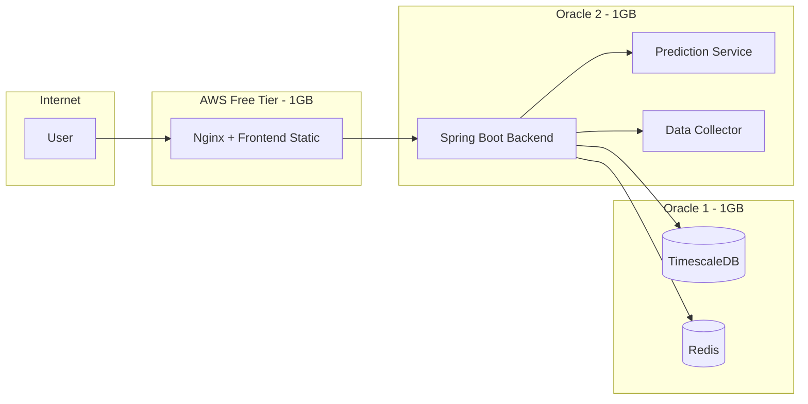

# 멀티 VPS 배포 (Oracle Cloud 2대 + AWS Free Tier 1대) 및 CI/CD

## 개요

이 문서는 **Oracle Cloud 2대**(VM.Standard.E2.1.Micro, 1 OCPU / 1GB RAM)와 **AWS Free Tier 1대**(t2.micro 또는 t3.micro, 1 vCPU / 1GB RAM)를 활용한 멀티 VPS 배포 토폴로지, 메모리 튜닝, CI/CD 파이프라인, 보안 및 체크리스트를 정리한다.

- **현재 구성**: OCI 2노드는 **Oracle Osaka**·**Oracle Korea** 두 서버로 운영한다. 아래 "Oracle 1" = 데이터 계층(예: Osaka), "Oracle 2" = 애플리케이션 계층(예: Korea) 역할로 매핑하면 된다. AWS는 선택 사항.
- **단일 VPS 배포**: [06-single-vps-batch-deployment.md](../08-setup-guides/06-single-vps-batch-deployment.md) 참조.
- **인프라 저장소**: [investment-infra](../../../investment-infra/README.md).

---

## 1. 인프라 스펙

| 리소스   | 별칭(예)   | 스펙                                       | 비고                          |
|----------|------------|--------------------------------------------|-------------------------------|
| Oracle 1 | Oracle Osaka | 1 OCPU, 1GB RAM, Public IP·Private IP 각 1개 (문서에 실제 값 기입 금지) | Always Free (E2.1.Micro)      |
| Oracle 2 | Oracle Korea | 1 OCPU, 1GB RAM, Public IP 1개 (문서에 실제 값 기입 금지)             | Always Free                   |
| AWS      | (선택)     | 1 vCPU, 1GB RAM (t2.micro / t3.micro)                                | Free Tier 12개월              |

- 실제 IP·호스트명·키 경로는 저장소·문서에 넣지 않는다. 배포/접속 시 본인 환경 값만 사용한다.
- 1GB × 2~3노드 제약이 있으므로 서비스별 역할 분리와 메모리 튜닝이 필수이다.

---

## 2. 노드 역할 분리

### 2.1 토폴로지 다이어그램



### 2.2 노드별 역할

| 노드     | 별칭(예)   | 역할                                      | 서비스 |
|----------|------------|-------------------------------------------|--------|
| Oracle 1 | Oracle Osaka | 데이터 계층                               | TimescaleDB, Redis |
| Oracle 2 | Oracle Korea | 애플리케이션 계층                         | Backend, prediction-service, data-collector |
| AWS      | (선택)     | 엣지 계층 (리버스 프록시 + 정적 프론트)   | Nginx, Frontend (정적 빌드물) |

- **Oracle 1 (Osaka)**: DB·Redis만 운영. 외부 트래픽 직접 노출하지 않음.
- **Oracle 2 (Korea)**: Backend가 Oracle 1의 DB/Redis와 Oracle 2 내부의 prediction-service, data-collector에 접속.
- **AWS**: 사용 시 Nginx가 사용자 요청을 받고, `/api` 등은 Oracle 2 Backend로 프록시.

### 2.3 리소스 타이트 시 대안

- Oracle 2에서 **prediction-service** 또는 **data-collector** 중 하나만 기동하고, 나머지는 Backend 설정에서 URL 비활성 또는 스킵.
- 또는 AWS에 prediction-service만 두고 Oracle 2에는 Backend + data-collector만 두는 구성으로 조정 가능.

---

## 3. 메모리 튜닝

### 3.1 Oracle 1 (TimescaleDB + Redis)

| 구성 요소   | 권장 설정 | 비고 |
|-------------|-----------|------|
| TimescaleDB | `shared_buffers = 256MB`, `max_connections = 20` | 1GB 노드에서 DB 전용으로 여유 확보 |
| Redis       | `maxmemory 128mb`, `maxmemory-policy allkeys-lru` | 256MB까지 가능하나 128MB로 시작 권장 |
| 스왑        | 1~2GB 스왑 파일 권장 | OOM 방지 |

### 3.2 Oracle 2 (Backend + prediction + data-collector)

| 구성 요소        | 권장 설정 | 비고 |
|------------------|-----------|------|
| Backend JVM      | `-Xms256m -Xmx512m` | 1GB 노드에서 Heap 상한 512MB |
| prediction-service | Docker `mem_limit: 256m` | 필요 시 128m으로 축소 |
| data-collector   | Docker `mem_limit: 256m` | 필요 시 128m으로 축소 |

동시에 셋을 모두 올리면 1GB를 초과할 수 있으므로, 초기에는 prediction 또는 data-collector 중 하나만 기동하거나, 둘 다 128MB limit으로 모니터링 후 조정한다.

### 3.3 AWS (Nginx + Frontend)

- Nginx와 정적 프론트만 서빙하므로 메모리 부담이 적다. 별도 튜닝 없이 기본값으로 운영 가능.

---

## 4. 네트워크

- **Oracle 1 ↔ Oracle 2**: 동일 VCN 내부라면 Private IP(예: 10.0.0.x)로 통신. Backend의 DB/Redis 연결 URL을 Oracle 1 Private IP로 설정.
- **AWS → Oracle 2**: Nginx가 Backend로 프록시할 때 Oracle 2의 **Public IP** 사용 (또는 VPN/PrivateLink 구성 시 사설 IP).
- **방화벽**: Oracle 1의 5432(TimescaleDB), 6379(Redis)는 Oracle 2(및 필요 시 AWS)에서만 접근 허용. SSH(22), HTTP(80), HTTPS(443)는 운영 정책에 따라 제한.

---

## 5. CI 파이프라인 (GitHub Actions 권장)

- 1GB 노드에 Jenkins를 두기 부담되므로 **GitHub Actions**를 기본 옵션으로 권장.
- **레지스트리**: `ghcr.io/<owner>/investment-*` (docker-compose.prod.yml의 `REGISTRY`, `*_TAG` 환경 변수 사용).

### 5.1 단계

1. **Checkout**: 메인/배포 브랜치 체크아웃.
2. **Build & Test**
   - Backend: `./gradlew test bootJar`
   - Frontend: `npm ci && npm run build && npm run test -- --run`
   - prediction-service: `pip install -r requirements.txt && pytest tests/ -v`
   - data-collector: 동일하게 빌드·테스트
3. **Docker Build & Push**
   - 각 서비스별 Dockerfile로 이미지 빌드.
   - 태그: `git commit SHA` 7자리 또는 `latest`.
   - `ghcr.io/<owner>/investment-backend:<tag>` 등으로 푸시 (GITHUB_TOKEN 또는 PAT).

### 5.2 트리거

- CI: PR/푸시 시 빌드·테스트·이미지 푸시.
- CD: `main`(또는 `release`) 푸시 시, 또는 태그 푸시(예: `deploy/v1.0.1`) 시 배포 job 실행.

### 5.3 사용 시크릿 (예시)

| 시크릿 이름 | 용도 |
|-------------|------|
| `GITHUB_TOKEN` | ghcr.io 푸시 (기본 제공) |
| `SSH_PRIVATE_KEY_ORACLE_OSAKA` | Oracle Osaka(Oracle 1) 배포 SSH — 저장소/문서에 키 내용 넣지 않음 |
| `SSH_PRIVATE_KEY_ORACLE_KOREA` | Oracle Korea(Oracle 2) 배포 SSH — 저장소/문서에 키 내용 넣지 않음 |
| `SSH_PRIVATE_KEY_AWS` | AWS 배포 SSH (AWS 사용 시) |

---

## 6. CD 파이프라인 (배포)

- **원칙**: 이미지 tag만 참조. 각 노드에서 `docker compose pull` 후 해당 서비스만 `up -d` 재기동.

### 6.1 노드별 CD 동작

| 노드     | CD 시 할 일 |
|----------|-------------|
| Oracle 1 | `docker compose -f docker-compose.oracle1.yml pull` (필요 시) 후 `up -d`. DB/Redis는 버전 고정 태그 사용 권장. |
| Oracle 2 | `BACKEND_TAG=<sha> PREDICTION_TAG=<sha> DATA_COLLECTOR_TAG=<sha>` 로 env 설정 후 `docker compose -f docker-compose.oracle2.yml pull backend prediction-service data-collector && docker compose -f docker-compose.oracle2.yml up -d` |
| AWS      | `FRONTEND_TAG=<sha>` 로 env 설정 후 `docker compose -f docker-compose.aws.yml pull frontend nginx && docker compose -f docker-compose.aws.yml up -d` |

### 6.2 배포 순서

1. Oracle 1 (DB·Redis) — 변경이 있을 때만.
2. Oracle 2 (Backend, prediction-service, data-collector).
3. AWS (Frontend, Nginx).

### 6.3 Compose 파일 분리 (옵션 B)

- 노드별 파일: `docker-compose.oracle1.yml`, `docker-compose.oracle2.yml`, `docker-compose.aws.yml` (investment-infra 루트에 위치).
- 각 파일에는 해당 노드에서 기동할 서비스만 정의. 이미지 태그는 환경 변수(`BACKEND_TAG`, `FRONTEND_TAG` 등)로 주입.
- 배포 스크립트: `investment-infra/scripts/deploy-oracle1.sh`, `deploy-oracle2.sh`, `deploy-aws.sh`, `set-env-tags.sh`. 사용법은 [scripts/README.md](../../../investment-infra/scripts/README.md) 참조.

### 6.4 롤백

- 이전에 성공 배포한 이미지 태그(이전 커밋 SHA)를 `*_TAG`에 넣고 동일 CD 단계를 재실행.
- 롤백에 사용할 태그는 GitHub Actions 아티팩트, 릴리스 메타데이터, 또는 수동 기록으로 관리.

---

## 7. 보안

- **SSH**: 배포용 키는 GitHub Secrets에만 저장. 노드에는 배포용 공개키만 등록.
- **방화벽**: 22(SSH), 80(HTTP), 443(HTTPS)만 필요 시 개방. DB(5432), Redis(6379)는 Oracle 2(및 필요 시 AWS) IP만 허용.
- **시크릿**: 비밀번호·API 키·DB URL 등은 저장소에 커밋하지 않는다. 노드별 `.env` 또는 GitHub Secrets → 배포 시 주입.

---

## 8. 배포 전·후 체크리스트

### 배포 전

- [ ] DB·Redis 접속 정보 및 방화벽 허용 (Oracle 1 → Oracle 2)
- [ ] 한국투자증권 API·계좌 설정(모의/실전 구분). **배포·테스트는 모의계좌만 사용**
- [ ] `PIPELINE_AUTO_EXECUTE`, `PIPELINE_ALLOW_REAL_EXECUTION` 등 환경 변수 확인
- [ ] Discord Webhook URL(미체결·리스크 알림 사용 시)
- [ ] 타임존: 스케줄은 Asia/Seoul 기준

### 배포 후

- [ ] Backend 헬스: `GET https://<oracle2-public>/actuator/health`
- [ ] 스케줄 현황: `GET https://<oracle2-public>/batch/api/jobs` (인증 필요)
- [ ] Flyway 마이그레이션: Backend 기동 시 자동 적용. 실패 시 로그 확인
- [ ] 프론트 접속: `https://<aws-public>/` → Nginx가 Backend로 프록시되는지 확인

---

## 9. Cursor Remote-SSH로 OCI 접속

Cursor에서 OCI 서버(Oracle 1 / Oracle 2)에 직접 붙어 원격 폴더를 열고, 파일 편집·터미널·Agent 작업을 하려면 Remote-SSH를 사용한다.

### 9.1 전제 조건

- OCI VM **Public IP** 및 **SSH(22)** 접속 가능(방화벽 허용).
- **SSH 비밀키**: OCI 인스턴스에 등록된 키(예: `id_rsa`, `id_ed25519` 또는 `.pem`). **저장소/문서에 키 내용을 넣지 않는다.**
- **OS 사용자**: Oracle Linux → `opc`, Ubuntu → `ubuntu`. 사용 중인 이미지에 맞게 적용.
- Windows: **OpenSSH 클라이언트** 설치 확인(`ssh -V`). 없으면 설정 > 앱 > 선택적 기능에서 OpenSSH 클라이언트 추가.

### 9.2 Cursor 확장

- Cursor 확장에서 **Remote - SSH** 검색 후 설치.
- **Cursor 전용** Remote-SSH 확장(`anysphere.remote-ssh`) 사용 권장(VSCode `ms-vscode-remote.remote-ssh` 대신).

### 9.3 SSH Config (Windows)

**파일**: `C:\Users\<사용자명>\.ssh\config`

Oracle Osaka / Oracle Korea 두 서버 예시(실제 IP·키 경로는 본인 환경으로 교체). **HostName에는 꺾쇠괄호를 넣지 말고 IP만 쓴다.**

```text
# Oracle Osaka (데이터 계층: DB/Redis)
Host oci-osaka-yoon
    HostName YOUR_ORACLE_OSAKA_PUBLIC_IP
    User ubuntu
    IdentityFile "YOUR_SSH_KEY_PATH_OSAKA"
    ServerAliveInterval 30
    ServerAliveCountMax 5

# Oracle Korea (애플리케이션 계층: Backend/Prediction/Data-collector)
Host oci-korea-jihee
    HostName YOUR_ORACLE_KOREA_PUBLIC_IP
    User ubuntu
    IdentityFile "YOUR_SSH_KEY_PATH_KOREA"
    ServerAliveInterval 30
    ServerAliveCountMax 5
```

- `HostName`: 각 VM의 Public IP.
- `User`: Oracle Linux `opc`, Ubuntu `ubuntu`.
- `IdentityFile`: 실제 비밀키 경로(예: `~/.ssh/oci_oracle.pem`). **경로에 공백이 있으면 반드시 큰따옴표로 감싼다**(예: `IdentityFile "D:/OneDrive - HKNC/path/to/key.key"`). 그렇지 않으면 "keyword identityfile extra arguments at end of line" 오류로 SSH가 config를 거부한다.
- `ServerAliveInterval` / `ServerAliveCountMax`: 연결 끊김 방지.
- Host 별칭은 예: `oci-oracle1`/`oci-oracle2` 또는 `oci-osaka-yoon`/`oci-korea-jihee` 등으로 둘 수 있다. SSH MCP 서버 이름과 맞추려면 [07-cursor-oci-ssh-mcp.md](../08-setup-guides/07-cursor-oci-ssh-mcp.md)의 `ssh-mcp-oracle-osaka-yoon` / `ssh-mcp-oracle-korea-jihee`와 대응되게 `oci-osaka-yoon` / `oci-korea-jihee`로 두면 편하다.

### 9.4 Cursor에서 접속 절차

1. **Ctrl+Shift+P** → "Remote-SSH: Connect to Host…" 선택.
2. 목록에서 `oci-osaka-yoon` 또는 `oci-korea-jihee` 선택.
3. 비밀키 패스프레이즈 입력(설정한 경우).
4. 연결 후 **열 폴더** 선택:
   - **Oracle Osaka**: `/home/ubuntu`(Ubuntu 이미지) 또는 investment-infra 클론 경로(예: `/home/ubuntu/investment-infra`). DB·Redis 설정·Compose 편집 시 사용.
   - **Oracle Korea**: `/home/ubuntu` 아래 investment-infra/ 앱 코드 경로. Backend/prediction/data-collector 배포·로그·스크립트 작업 시 사용.
5. 해당 호스트가 원격 워크스페이스로 열리면, 터미널·파일 편집·Agent 모두 그 서버에서 동작한다.

### 9.5 노드별 작업 요약

| 노드          | Cursor에서 주로 하는 작업 |
|---------------|---------------------------|
| Oracle Osaka  | DB/Redis Compose·설정 변경, 스크립트 실행, 로그 확인 |
| Oracle Korea  | Backend/prediction/data-collector 배포·재기동, 로그·환경 변수 확인, investment-infra 스크립트 실행 |

### 9.6 Windows: SSH config 권한 오류 해결

Remote-SSH 연결 시 **"Bad owner or permissions on C:\\Users\\\<사용자명>\\.ssh\\config"** 또는 **"Try removing permissions for user: UNKNOWN\\\\UNKNOWN"** 가 나오면, OpenSSH가 config 파일의 권한을 거부한 것이다. Windows에서는 해당 파일(또는 `.ssh` 폴더)에 다른 사용자/상속된 권한이 있으면 발생한다.

**해결 절차**(PowerShell을 **관리자 권한**으로 실행 후):

1. **권한 문자열을 변수로 지정** (PowerShell이 `(OI)(CI)F` 또는 `USERNAME:F`를 잘못 쪼개지 않도록):

```powershell
$me = $env:USERNAME
$permFolder = "${me}:(OI)(CI)F"
$permFile   = "${me}:F"
```

2. **.ssh 폴더** — 상속 제거 후 현재 사용자 권한 추가. 권한 문자열은 **반드시 따옴표로 한 덩어리**로 넘긴다 (`<사용자명>`은 실제 로그인 이름, 예: HNW):

```powershell
icacls "$env:USERPROFILE\.ssh" /inheritance:r
icacls "$env:USERPROFILE\.ssh" /grant "<사용자명>:(OI)(CI)F"
```

3. **config 파일** — **takeown 직후** 같은(관리자) 창에서 icacls 실행. 권한 문자열을 따옴표로 한 덩어리로:

```powershell
takeown /f "$env:USERPROFILE\.ssh\config"
icacls "$env:USERPROFILE\.ssh\config" /inheritance:r
icacls "$env:USERPROFILE\.ssh\config" /grant "<사용자명>:F"
```

4. **비밀키 파일** (경로·`<사용자명>` 본인 값으로):

```powershell
icacls "D:\path\to\ssh-key-1.key" /inheritance:r
icacls "D:\path\to\ssh-key-1.key" /grant "<사용자명>:F"
icacls "D:\path\to\ssh-key-2.key" /inheritance:r
icacls "D:\path\to\ssh-key-2.key" /grant "<사용자명>:F"
```

- **참고**: 변수(`$permFile`)를 쓰면 "매개 변수가 잘못되었습니다"가 나올 수 있다. 권한은 **따옴표로 감싼 한 문자열**로 넣는다(예: `/grant "HNW:F"`).

5. **확인**: `ssh -T oci-osaka-yoon` 으로 접속 테스트. 권한 오류 없이 패스워드/키 입력 단계로 넘어가면 성공.

6. **OneDrive 등 동기화 폴더**에 `.ssh`를 두었다면, 동기화가 권한을 바꿀 수 있다. 가능하면 `.ssh`는 사용자 프로필(`C:\Users\<사용자명>\.ssh`)에 두고, 키 파일만 다른 드라이브를 쓰는 편이 안정적이다.

---

## 10. 참고 문서

- [단일 VPS·배치·배포 절차](../08-setup-guides/06-single-vps-batch-deployment.md)
- [서버 스펙](03-server-specification.md)
- [investment-infra README](../../../investment-infra/README.md)
- [개발 진행 현황](../09-planning/02-development-status.md)
- [Cursor OCI SSH MCP (로컬에서 원격 명령)](../08-setup-guides/07-cursor-oci-ssh-mcp.md)

---

## 문서 변경 이력

| 버전 | 일자       | 변경 내용 |
|------|------------|-----------|
| 1.0  | 2026-02-11 | 초안: Oracle 2대 + AWS 1대 토폴로지, CI/CD, 메모리 튜닝, 보안, 체크리스트 |
| 1.1  | 2026-02-11 | Cursor Remote-SSH로 OCI 접속 절(§9) 및 SSH MCP 참고 문서 링크 추가 |
| 1.2  | 2026-02-11 | 두 서버 기준 정리: Oracle Osaka / Oracle Korea 별칭·역할 매핑, 시크릿·SSH config 플레이스홀더화(민감정보 제외) |
