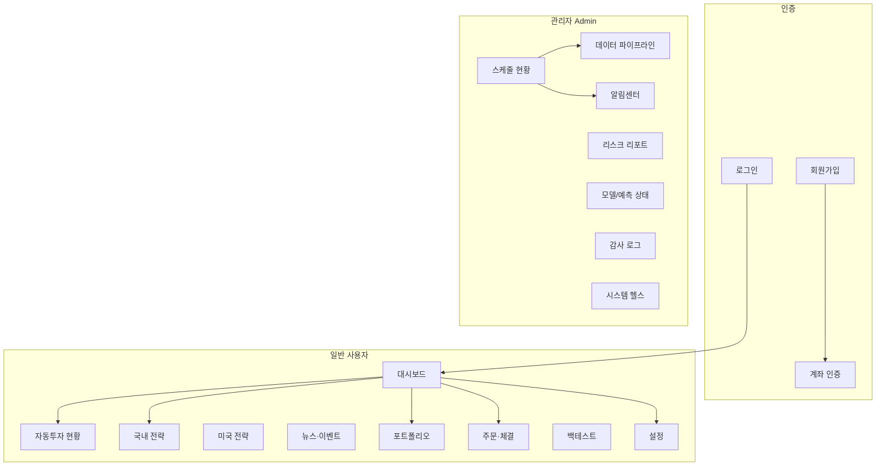

# 정보 구조(IA) — 사이트맵·내비 규칙

## 1. 사이트맵 개요

## 2. 메뉴 트리(경로·메뉴 ID)

### 2.1 공통(비인증)

| 순서 | 메뉴 ID | 표시명 | 경로 |
|------|---------|--------|------|
| - | auth-login | 로그인 | `/login` |
| - | auth-signup | 회원가입 | `/signup` |

### 2.2 일반 사용자(User) — 인증 후

| 순서 | 메뉴 ID | 표시명 | 경로 |
|------|---------|--------|------|
| 1 | dashboard | 대시보드 | `/` |
| 2 | auto-invest | 자동투자 현황 | `/auto-invest` |
| 3 | strategy-kr | 국내 전략 | `/strategies/kr` |
| 4 | strategy-us | 미국 전략 | `/strategies/us` |
| 5 | news-events | 뉴스·이벤트 | `/news` |
| 6 | portfolio | 포트폴리오 | `/portfolio` |
| 7 | orders | 주문·체결 | `/orders` |
| 8 | schedule-status | 스케줄 현황 | `/batch` |
| 9 | backtest | 백테스트 | `/backtest` |
| 10 | settings | 설정 | `/settings` |

### 2.3 관리자(Admin) 전용

| 메뉴 ID | 표시명 | 경로 |
|---------|--------|------|
| data-pipeline | 데이터 파이프라인 상태 | `/ops/data` |
| alerts | 알림센터 | `/ops/alerts` |
| risk-report | 리스크 리포트 | `/risk` |
| model-status | 모델/예측 상태 | `/ops/model` |
| audit-log | 감사 로그 | `/ops/audit` |
| system-health | 시스템 헬스 | `/ops/health` |

## 3. 내비게이션 규칙

- **전역 계좌 탭**: 로그인 사용자 화면에서 메뉴 바로 아래 **모의계좌 | 실계좌** 탭 표시. 탭 선택 시 URL 쿼리 `serverType=1`(모의) / `serverType=0`(실계좌) 유지. 기본값 `1`.
- **링크 정합성**: 모든 메뉴 링크·빠른 액션·내부 링크에 현재 `serverType` 쿼리 포함. 예: `/auto-invest?serverType=1`.
- **헤더 로고**: 클릭 시 `/`(대시보드)로 이동, 현재 `serverType` 쿼리 유지.
- **Admin 메뉴 노출**: 역할이 관리자(Admin)일 때만 Admin 전용 메뉴(§2.3) 노출. User일 때는 스케줄 현황(`/batch`)까지 가능, 나머지 Admin 메뉴는 숨김 또는 비활성.

## 4. 참고

- 상세 메뉴별 화면 역할·요소: [01-screen-menu-spec.md](../01-screen-menu-spec.md) §3.
- 권한별 메뉴 접근: [02-roles-and-permissions.md](02-roles-and-permissions.md).
