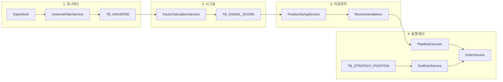

# 4단계 파이프라인 구현 계획

## 현재 상태 요약

- **2단계(시그널 생성)** 일부 완료: [FactorCalculationService](src/main/java/com/investment/factor/service/FactorCalculationService.java)가 이격도(DISPARITY)·변동성 돌파(VOLATILITY_BREAKOUT)·유동성(LIQUIDITY)을 [TB_SIGNAL_SCORE](src/main/resources/db/migration/V5__add_tb_signal_score.sql)에 저장. [FactorCalculationScheduler](src/main/java/com/investment/factor/scheduler/FactorCalculationScheduler.java) 매일 08:00 실행.
- **1단계(유니버스)**: 없음. 시그널은 전체 DailyStock 종목 대상으로 계산됨.
- **3단계(자금 관리)**: 없음.
- **4단계(실행·청산)**: [OrderService](src/main/java/com/investment/order/service/OrderService.java)로 수동/API 주문만 가능. 파이프라인 연동·청산 규칙 없음.

**참조 문서**: [자동투자 전략 명세 §5](docs/02-architecture/12-auto-investment-strategy.md), [개발 진행 현황](docs/09-planning/02-development-status.md).

---

## 1단계: 유니버스 필터링 (Universe Selection)

**목표**: "어떤 종목을 감시 대상에 넣을 것인가?" — 유니버스 통과 종목만 2단계 시그널 계산 대상으로 사용.

| 구분  | 알고리즘                     | 현재 데이터로 가능 여부                                                                   |
| --- | ------------------------ | ------------------------------------------------------------------------------- |
| 공통  | Liquidity Cut-off        | 가능. `DailyStock.trdVal` ≥ 임계값 (기존 `investment.factor.liquidity-min-trd-val` 활용) |
| 한국  | Sector Relative Strength | 업종/섹터 데이터 필요. 1차는 스킵 또는 스텁(전체 유동성 통과만)                                          |
| 미국  | Post-Earnings Drift      | 어닝 서프라이즈 데이터 필요. 1차는 스킵 또는 스텁                                                   |

**구현 방향**

- **TB_UNIVERSE** 신규: `(BAS_DT, MARKET, SYMBOL)` — 유동성 등 기준 통과 종목만 저장. (필요 시 `CRITERIA` 컬럼 추가)
- **UniverseFilterService** 신규
  - `filterByLiquidity(basDt, market)`: `DailyStock`에서 `trdVal >= liquidityMinTrdVal`인 종목 조회 후 TB_UNIVERSE 저장.
  - KR Sector RS / US Post-Earnings: 1차에서는 미구현 또는 빈 구현(같은 유동성 결과만 반환).
- **스케줄**: 유니버스 필터를 **팩터 계산 전**에 실행. `FactorCalculationScheduler`와 동일 08:00 또는 그 직전(예: 07:55)에 `UniverseFilterService.run(basDt)` 호출 후, `FactorCalculationService`는 **해당 basDt의 유니버스 종목만** 대상으로 시그널 계산.
- **FactorCalculationService 수정**: `calculateAndSave(basDt, market)` 시 `UniverseFilterService.getSymbols(basDt, market)` 또는 Repository로 유니버스 종목 목록을 조회해, 해당 symbol만 루프.

**영향 파일**

- 신규: `db/migration/V6__add_tb_universe.sql`, rollback, `Universe` 엔티티(또는 복합키), `UniverseRepository`, `UniverseFilterService`, (선택) `UniverseScheduler`.
- 수정: [FactorCalculationService](src/main/java/com/investment/factor/service/FactorCalculationService.java) — 유니버스 종목만 필터링, [FactorCalculationScheduler](src/main/java/com/investment/factor/scheduler/FactorCalculationScheduler.java) — 유니버스 실행 순서 추가.
- 설정: [application.yml](src/main/resources/application.yml) `investment.factor` 또는 `investment.universe` (유동성 임계값은 기존과 공유 가능).

---

## 2단계: 시그널 생성 (Signal Generation) — 연동만

**목표**: 유니버스 종목에 대해서만 시그널 생성; 필요 시 시그널 유형 확장.

- **1단계 연동**: 위와 같이 FactorCalculationService가 **유니버스 종목만** 대상으로 기존 이격도·변동성 돌파·유동성 계산. (신규 팩터 타입 없이도 4단계 "파이프라인" 연결 가능.)
- **추가 시그널(선택, 2차)**  
  - 한국: 수급 강도(Smart Money Intensity) — 수급/순매수 데이터 필요.  
  - 미국: 듀얼 모멘텀, 퀄리티-성장(PEG, Rule of 40) — 미국 일별·펀더멘털 데이터 확보 후 확장.

**구현**: 1단계에서 FactorCalculationService 입력을 유니버스로 제한하면 2단계는 "연동 완료"로 간주. 신규 팩터는 별도 태스크로 진행 가능.

---

## 3단계: 자금 관리 (Position Sizing)

**목표**: "얼마나 살 것인가?" — 시그널별 권장 매수 금액/수량 산출.

- **PositionSizingService** 신규
  - 입력: 기준일(basDt), 시장(market), 계좌/총자산(또는 금액), 리스크 파라미터(예: 1회 1% 리스크, Half-Kelly 기본값).
  - 입력 데이터: 해당 basDt·market의 SignalScore 목록, DailyStock(ATR·변동성용), (선택) 계좌 잔고.
  - 출력: 종목별 권장 매수 금액 또는 수량 (DTO 목록).
- **적용 공식 (명세 §4·§5.3)**  
  - **ATR 포지션 사이징**: `Position Size = (Capital × 1%) / (Entry - StopLoss)`. StopLoss는 전일 저가 또는 ATR 기반.  
  - **Half-Kelly**: 승률·손익비 기본값으로 비중 상한 계산 (파라미터화).  
  - **변동성 역가중**: 여러 종목에 분배 시 비중 ∝ 1/σ (σ: 최근 일별 수익률 표준편차).
- **저장**: 1차는 API/서비스 응답만 반환. 감사/재현이 필요하면 `TB_POSITION_RECOMMENDATION`(bas_dt, symbol, market, recommended_amt, method 등) 테이블 추가 검토.
- **API(선택)**: `GET /api/v1/position-recommendations?basDt=&market=` — 자동투자 현황 화면에서 "권장 포지션" 표시용.

---

## 4단계: 매매 실행 및 청산 (Execution & Exit)

**목표**: 권장 포지션 주문 실행 + 보유 포지션에 대한 청산 규칙(ATR Trailing Stop, Time-Cut) 평가.

**4-1. 실행(Execution)**

- **PipelineExecutor**(또는 기존 스케줄러 확장) 신규/확장
  - PositionSizingService 결과를 받아, 계좌·종목별로 OrderService.executeOrder 호출.
  - **안전**: 1차는 **드라이런 모드**만 구현(주문 생성하지 않고 로그/결과만 반환). 실제 주문은 설정 플래그(예: `investment.pipeline.auto-execute=false`)로 켜는 방식 권장.
- **실제 주문**: 한국투자증권 API는 기존 [OrderService](src/main/java/com/investment/order/service/OrderService.java) + [KoreaInvestmentOrderClient](src/main/java/com/investment/order/client/KoreaInvestmentOrderClient.java) 활용. MCP 규칙에 따라 주문 API 스펙은 MCP로 확인.

**4-2. 청산(Exit)**

- **보유 추적**: 파이프라인으로 매수한 포지션만 청산 규칙 적용하려면 "진입 시점" 정보 필요.
  - **TB_STRATEGY_POSITION** (또는 유사명) 신규: `account_no, symbol, market, entry_dt, entry_price, quantity, trailing_high, atr_multiplier, time_cut_days, target_return_pct` 등.
  - 매수 체결 시(또는 PipelineExecutor에서 주문 성공 시) 이 테이블에 INSERT.
- **ExitRuleService** 신규
  - ATR Trailing Stop: 보유 고가(trailing_high) 대비 현재가 하락이 설정 배수(예: 2.0~2.5) × ATR 이상이면 매도 시그널.
  - Time-Cut: 진입 후 N일 경과 시 목표 수익률 미도달이면 전량 매도 시그널.
  - 입력: 계좌, (선택) 현재가/일봉 — 보유 목록은 API 잔고 + TB_STRATEGY_POSITION 조인.
- **Executor**: ExitRuleService의 매도 시그널을 OrderService로 전달. 마찬가지로 1차는 드라이런 옵션 권장.

**4-3. 스케줄**

- 실행: 장 시작 후 유니버스·시그널·포지션 사이징이 준비된 뒤 1회(예: 09:10) 또는 수동 트리거.
- 청산: 장중 주기(예: 1분마다) 또는 장 마감 전 1회 — 보유 포지션에 대해 ExitRuleService 호출 후 매도 주문.

---

## 데이터 흐름 (요약)

---

## DB 마이그레이션·롤백

- **V6**: `TB_UNIVERSE` 생성. 롤백 스크립트 `V6_rollback.sql` 필수(프로젝트 규칙).
- **V7(선택)**: `TB_POSITION_RECOMMENDATION` — 감사용으로 도입 시.
- **V7 또는 V8**: `TB_STRATEGY_POSITION` — 청산 규칙용 진입 이력.

모든 DDL 적용 전 백업 권장. 문서: [development-status](docs/09-planning/02-development-status.md), [로드맵](docs/roadmap.md).

---

## 문서·설정 갱신

- [02-development-status.md](docs/09-planning/02-development-status.md): 진행중 → "4단계 파이프라인 구현", 완료 시 완료 섹션에 항목 추가.
- [roadmap.md](docs/roadmap.md): Phase 5.2 4단계 파이프라인 체크리스트 갱신.
- [01-api-overview.md](docs/04-api/01-api-overview.md): 유니버스·포지션 권장 API 추가 시 반영.
- [12-auto-investment-strategy.md](docs/02-architecture/12-auto-investment-strategy.md): 구현 상태 문단 추가(선택).
- `application.yml`: `investment.pipeline.auto-execute`, `investment.universe.*` 등 새 설정 항목 문서화.

---

## 구현 순서 권장

1. **유니버스**: V6 마이그레이션, 엔티티/Repository, UniverseFilterService(유동성만), 스케줄러 연동, FactorCalculationService 유니버스 필터 적용.
2. **자금 관리**: PositionSizingService(ATR 사이징·변동성 역가중), (선택) API·TB 저장.
3. **실행·청산**: TB_STRATEGY_POSITION, PipelineExecutor(드라이런), ExitRuleService, 매수 체결 시 포지션 등록 및 청산 스케줄/트리거.

테스트: 유니버스/팩터/포지션 서비스 단위 테스트, PipelineExecutor·ExitRuleService는 Mock OrderService로 슬라이스 테스트. 커버리지 규칙(라인 80%, 브랜치 70%) 유지.

---

## 데이터 부족 시 대응 및 후속 보충 개발계획

코드 기획·구현 시 **필요 데이터가 없거나 부족한 경우** 1차에서는 스텁/기본값/스킵으로 진행하고, **다음 단계에서 반드시 보충**할 수 있도록 개발계획 목록을 구체적으로 둔다. 구현 시 이 목록을 참조해 인터페이스·확장점을 남겨 두고, 데이터 확보 시 해당 항목을 완료한다.

### 1단계(유니버스) — 데이터 부족·후속 보충

| 부족 데이터                                   | 현재 대응 (1차)                                      | 보충 담당 단계                    | 후속 개발계획 (구체 목록)                                                                                                                                                                        |
| ---------------------------------------- | ----------------------------------------------- | --------------------------- | -------------------------------------------------------------------------------------------------------------------------------------------------------------------------------------- |
| **한국 업종/섹터** (Sector Relative Strength용) | KR Sector RS 미구현. 유동성 통과 종목만 유니버스로 사용.          | 뉴스·공시 파이프라인 또는 데이터 수집 확장    | ① KRX/외부 API에서 업종·섹터 코드 수집 스키마·수집 job 추가. ② 업종별 수익률(또는 지수 대비 상대 강도) 계산. ③ UniverseFilterService에 `filterBySectorRelativeStrength(basDt, market)` 구현 후 유니버스 산출 시 Liquidity와 AND 조건 적용.  |
| **미국 어닝 서프라이즈** (Post-Earnings Drift용)   | US Post-Earnings Drift 미구현. 유동성 통과만 사용.         | 뉴스·공시 파이프라인 또는 Yahoo/SEC 연동 | ① Yahoo Earnings Calendar·실적 컨센서스 또는 SEC 8-K/10-Q 수집. ② 어닝 서프라이즈 강도(실적 vs 컨센서스) 지표 정의·저장. ③ UniverseFilterService에 `filterByPostEarningsDrift(basDt, market)` 구현, 상위 20% 종목만 유니버스에 포함. |
| **미국 일별 시세** (US DailyStock)             | KR만 KRX로 수집 중. US는 TB_DAILY_STOCK에 데이터 없을 수 있음. | 데이터 수집 연동(미국 원천)            | ① Yahoo/TAAPI 등 미국 일별 OHLCV 수집 job·저장(TB_DAILY_STOCK, market=US). ② 유니버스·팩터 계산 시 market=US 분기 동작 검증.                                                                                   |

### 2단계(시그널) — 데이터 부족·후속 보충

| 부족 데이터                                      | 현재 대응 (1차)     | 보충 담당 단계         | 후속 개발계획 (구체 목록)                                                                                                                                         |
| ------------------------------------------- | -------------- | ---------------- | ------------------------------------------------------------------------------------------------------------------------------------------------------- |
| **한국 수급/순매수** (Smart Money Intensity)       | 수급 강도 시그널 미구현. | 한국투자증권 API·수집 확장 | ① KIS API 또는 외부에서 종목별 기관/외국인 순매수(금액)·체결강도 수집. ② 5일 누적 순매수 vs 시총 비율 계산. ③ FactorCalculationService에 FACTOR_SMART_MONEY_INTENSITY 추가, TB_SIGNAL_SCORE 저장. |
| **미국 듀얼 모멘텀·퀄리티-성장** (PEG, Rule of 40, 모멘텀) | 미국 전용 시그널 미구현. | 미국 일별·펀더멘털 수집    | ① 미국 일별 수익률·지수(S&P500 등) 수집. ② PER/PEG·Rule of 40(매출증가율+영업이익률)용 재무 데이터 수집(Yahoo/SEC). ③ FactorCalculationService에 듀얼 모멘텀·퀄리티-성장 팩터 타입 추가, 시그널 생성·저장.    |

### 3단계(자금 관리) — 데이터 부족·후속 보충

| 부족 데이터                        | 현재 대응 (1차)                           | 보충 담당 단계             | 후속 개발계획 (구체 목록)                                                                                |
| ----------------------------- | ------------------------------------ | -------------------- | ---------------------------------------------------------------------------------------------- |
| **승률·손익비** (Half-Kelly용 p, b) | 기본값(p=0.6, b=2) 또는 설정값으로 계산.         | 백테스팅·성과 분석           | ① 백테스팅 결과에서 종목/전략별 승률·평균 손익비 산출. ② PositionSizingService에 백테스트 기반 p·b 주입 옵션 추가(또는 전략별 설정 테이블). |
| **ATR·StopLoss** (진입가 대비 손절가) | 전일 저가 또는 고정 비율(예: -2%)로 StopLoss 근사. | 일별 데이터·ATR 계산        | ① DailyStock 기반 ATR(14일 등) 계산 유틸 추가. ② PositionSizingService에서 ATR 기반 손절 거리 사용 옵션 추가.          |
| **실시간 계좌 잔고**                 | 요청 시점 잔고 API 호출 또는 캐시값 사용.           | 기존 AccountService 활용 | ① 자금관리 호출 전 잔고 갱신·캐시 TTL 정책 명시. ② 포지션 사이징 시 "총자산 대비 비중" 상한 설정 검증.                              |

### 4단계(실행·청산) — 데이터 부족·후속 보충

| 부족 데이터                                 | 현재 대응 (1차)                                                    | 보충 담당 단계         | 후속 개발계획 (구체 목록)                                                                                                        |
| -------------------------------------- | ------------------------------------------------------------- | ---------------- | ---------------------------------------------------------------------------------------------------------------------- |
| **실시간/장중 현재가·고가** (ATR Trailing Stop용) | 일봉 종가·고가만 사용 시 당일 고가 부재.                                      | 시장 데이터·WebSocket | ① 장중 현재가·당일 고가 조회(KIS 시세 API 또는 캐시) 연동. ② ExitRuleService에서 trailing_high 갱신 시 "당일 고가 vs DB 저장 고가" 중 큰 값 사용.           |
| **체결 확정 시점** (포지션 등록 타이밍)              | 주문 요청 성공 시 TB_STRATEGY_POSITION INSERT 시, 실제 체결가·수량은 다를 수 있음. | KIS 체결 조회·웹훅     | ① 체결 조회 API 주기 폴링 또는 체결 Push 수신 시 TB_STRATEGY_POSITION에 실제 체결가·수량·체결시각 반영. ② PipelineExecutor는 "체결 확인 후 포지션 등록" 옵션 지원. |

### 공통 — 개발계획 목록 반영 규칙

- **신규 서비스/필터 추가 시**: 위 표에 "부족 데이터"가 있으면 1차 구현에서 **인터페이스·확장 포인트**를 두고, 표의 "후속 개발계획"을 **개발 진행 현황(02-development-status.md)** 의 "진행예정" 또는 로드맵 체크리스트에 **구체 태스크로 추가**한다.
- **데이터 수집/외부 연동**이 필요한 보충 항목은 **뉴스·공시 파이프라인**, **데이터 수집 연동**, **백테스팅** 등 관련 Phase와 연결해 일정을 조정한다.
- 이 섹션은 **4단계 파이프라인 구현** 계획의 일부로 유지하며, 후속 Phase에서 데이터 보충 작업을 할 때 이 목록을 참조·갱신한다.
